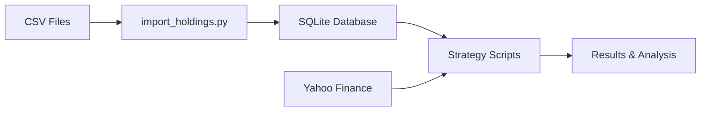
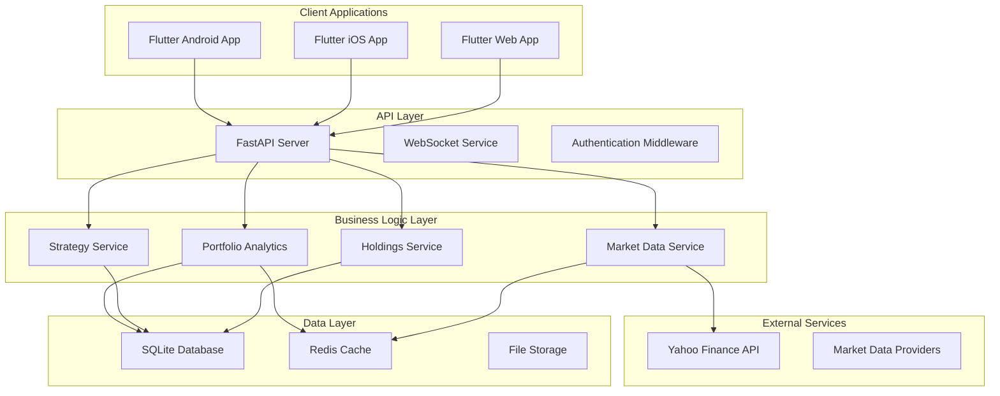
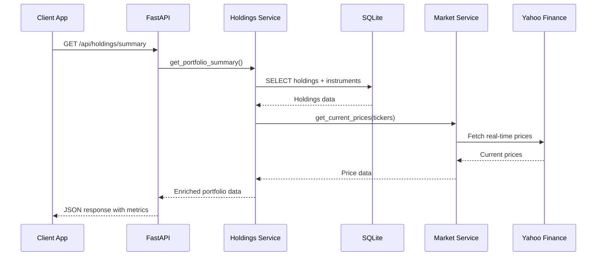

# Multi-Platform Automated Trading Application Architecture Plan

## Executive Summary

This document outlines the comprehensive architecture plan for converting the existing automated trading scripts into multi-platform applications (web, iOS, Android) with an initial focus on holdings visualization. The plan leverages existing SQLite database structure and Python business logic while introducing modern API and frontend technologies.

## 1. Current System Analysis

### Existing Components
- **Database**: SQLite with 4 tables:
  - `instruments` (ticker, type, sector, industry, currency, etc.)
  - `holdings` (account, ticker, quantity, cost_basis, dates)
  - `strategy_run` (run metadata and parameters)
  - `strategy_result` (individual ticker results and metrics)

- **Python Scripts**:
  - [`db.py`](db.py:1): Database layer with schema management
  - [`import_holdings.py`](import_holdings.py:1): CSV import functionality
  - [`bullish_strategy.py`](bullish_strategy.py:1): Technical analysis screener
  - [`buffett_screener.py`](buffett_screener.py:1): Value investing screener
  - [`leap_entry_strategy.py`](leap_entry_strategy.py:1): Options strategy screener

- **Dependencies**: yfinance, pandas, numpy, html5lib, lxml

### Data Flow


## 2. Technology Stack Decisions

### Backend API Framework: FastAPI
**Rationale:**
- **Python Compatibility**: Seamless integration with existing Python codebase
- **Performance**: Async support and automatic API documentation
- **Type Safety**: Built-in Pydantic models match existing dataclass patterns
- **Ecosystem**: Easy integration with pandas, numpy, and yfinance

**Alternatives Considered:**
- Flask: Too basic for complex API needs
- Django REST: Over-engineered for this use case

### Frontend Framework: Flutter
**Rationale:**
- **Cross-Platform**: Single codebase for web, iOS, and Android
- **Performance**: Native compilation for mobile platforms
- **Rich UI**: Excellent charting libraries (fl_chart, syncfusion_flutter_charts)
- **Mature Ecosystem**: Strong HTTP client and state management

**Alternatives Considered:**
- React Native: Limited web support, JavaScript overhead
- Native Development: 3x development effort
- Progressive Web App: Limited mobile capabilities

### Database Strategy: Keep SQLite + Add Caching
**Rationale:**
- **Existing Investment**: Schema and data already established
- **Simplicity**: Single file, no server setup required
- **Performance**: Add Redis for API response caching
- **Portability**: Easy backup and migration

### State Management: Riverpod (Flutter)
**Rationale:**
- **Modern**: Latest Flutter state management paradigm
- **Type Safety**: Compile-time dependency injection
- **Testing**: Easy to mock and test
- **Performance**: Efficient rebuilds and caching

## 3. System Architecture

### High-Level Component Diagram



### Data Flow for Holdings Visualization



## 4. API Endpoint Design

### Holdings API Endpoints

#### GET `/api/holdings/summary`
```json
{
  "total_value": 150000.50,
  "total_cost_basis": 120000.00,
  "total_gain_loss": 30000.50,
  "total_gain_loss_percent": 25.0,
  "accounts": [
    {
      "account": "MAIN",
      "value": 150000.50,
      "cost_basis": 120000.00,
      "positions_count": 25
    }
  ],
  "top_holdings": [
    {
      "ticker": "AAPL",
      "company_name": "Apple Inc.",
      "quantity": 100.0,
      "current_price": 175.50,
      "market_value": 17550.00,
      "cost_basis": 15000.00,
      "gain_loss": 2550.00,
      "gain_loss_percent": 17.0,
      "weight": 11.7
    }
  ],
  "sector_allocation": [
    {
      "sector": "Technology",
      "value": 75000.00,
      "weight": 50.0
    }
  ]
}
```

#### GET `/api/holdings/positions`
**Query Parameters:**
- `account` (optional): Filter by account
- `ticker` (optional): Filter by specific ticker
- `limit` (optional): Limit results

```json
{
  "positions": [
    {
      "holding_id": 1,
      "account": "MAIN",
      "ticker": "AAPL",
      "company_name": "Apple Inc.",
      "quantity": 100.0,
      "cost_basis": 150.00,
      "current_price": 175.50,
      "market_value": 17550.00,
      "unrealized_gain_loss": 2550.00,
      "unrealized_gain_loss_percent": 17.0,
      "sector": "Technology",
      "industry": "Consumer Electronics",
      "currency": "USD",
      "opened_at": "2024-01-15",
      "last_update": "2024-12-10T10:30:00Z"
    }
  ]
}
```

#### GET `/api/holdings/performance`
```json
{
  "daily_returns": [
    {
      "date": "2024-12-10",
      "portfolio_value": 150000.50,
      "daily_change": 1250.75,
      "daily_change_percent": 0.84
    }
  ],
  "performance_metrics": {
    "total_return": 25.0,
    "annualized_return": 12.5,
    "volatility": 15.2,
    "sharpe_ratio": 0.82,
    "max_drawdown": -8.5
  }
}
```

### Market Data API Endpoints

#### GET `/api/market/prices`
**Query Parameters:**
- `tickers`: Comma-separated list of tickers

```json
{
  "prices": {
    "AAPL": {
      "price": 175.50,
      "change": 2.25,
      "change_percent": 1.3,
      "timestamp": "2024-12-10T16:00:00Z"
    }
  }
}
```

### Strategy Results API Endpoints

#### GET `/api/strategies/runs`
```json
{
  "runs": [
    {
      "run_id": "uuid-123",
      "strategy_code": "bullish_breakout",
      "started_at": "2024-12-10T09:00:00Z",
      "completed_at": "2024-12-10T09:15:00Z",
      "universe_size": 500,
      "passed_count": 25,
      "min_score": 70
    }
  ]
}
```

## 5. Implementation Phases

### Phase 1: Core API and Web Viewer (4-6 weeks)
**Goals:** Basic holdings visualization with web interface

**Deliverables:**
1. **Week 1-2: API Foundation**
   - FastAPI project setup with Docker
   - Database connection and ORM models
   - Basic holdings endpoints
   - API documentation with Swagger

2. **Week 3-4: Flutter Web App**
   - Flutter web project initialization
   - HTTP client setup with dio
   - Holdings summary dashboard
   - Basic charts with fl_chart

3. **Week 5-6: Integration & Polish**
   - Real-time price integration
   - Error handling and loading states
   - Responsive design
   - Basic testing

**Success Criteria:**
- Web app displays portfolio summary
- Real-time price updates
- Responsive design works on desktop/tablet
- API documentation complete

### Phase 2: Mobile Apps (3-4 weeks)
**Goals:** Native iOS and Android apps with same functionality

**Deliverables:**
1. **Week 1-2: Mobile App Development**
   - iOS and Android builds
   - Mobile-optimized UI components
   - Touch interactions and gestures
   - App store preparation

2. **Week 3-4: Mobile-Specific Features**
   - Push notifications for alerts
   - Biometric authentication
   - Offline data caching
   - App store deployment

**Success Criteria:**
- Apps published to stores
- Feature parity with web version
- Smooth 60fps performance
- Offline viewing capability

### Phase 3: Enhanced Features (4-6 weeks)
**Goals:** Advanced analytics and strategy integration

**Deliverables:**
1. **Strategy Results Integration**
   - Strategy run history
   - Performance analytics
   - Custom alerts and notifications

2. **Advanced Portfolio Features**
   - Historical performance charts
   - Risk analysis and metrics
   - Portfolio optimization suggestions
   - Export and reporting features

3. **Real-Time Enhancements**
   - WebSocket price feeds
   - Live portfolio updates
   - Market news integration

**Success Criteria:**
- Strategy results visualization
- Real-time updates without refresh
- Advanced analytics dashboard
- Export functionality

## 6. Holdings Visualization Specifications

### Required Data Points
From [`holdings`](db.py:58) + [`instruments`](db.py:41) tables:
- Position details: ticker, quantity, cost_basis, account
- Instrument metadata: company name, sector, industry, currency
- Market data: current price, daily change, volume
- Calculated metrics: market value, unrealized P&L, weight

### Chart Types and Visualizations

#### 1. Portfolio Overview Dashboard
- **Donut Chart**: Asset allocation by sector/industry
- **Treemap**: Holdings by market value (size) and performance (color)
- **KPI Cards**: Total value, daily change, total return

#### 2. Position Details View
- **Data Table**: Sortable/filterable positions list
- **Bar Chart**: Top 10 holdings by value or weight
- **Performance Cards**: Best/worst performers

#### 3. Performance Analytics
- **Line Chart**: Portfolio value over time
- **Area Chart**: Daily returns distribution
- **Gauge Charts**: Performance metrics (Sharpe ratio, volatility)

#### 4. Interactive Features
- **Drill-down**: Click sector → see holdings in that sector
- **Time Range Selector**: 1D, 1W, 1M, 3M, 1Y, All
- **Search/Filter**: By ticker, sector, account
- **Sort Options**: By value, return, alphabetical

### Responsive Design Considerations
- **Mobile First**: Touch-friendly interactions
- **Tablet**: Two-column layouts
- **Desktop**: Multi-panel dashboards
- **Charts**: Auto-resize and simplified mobile versions

## 7. Development Environment Setup

### Backend Development
```bash
# 1. Create FastAPI project
mkdir trading-api
cd trading-api
python -m venv venv
source venv/bin/activate  # or venv\Scripts\activate on Windows

# 2. Install dependencies
pip install fastapi uvicorn pydantic sqlalchemy python-multipart
pip install pandas numpy yfinance redis aioredis

# 3. Project structure
trading-api/
├── app/
│   ├── __init__.py
│   ├── main.py
│   ├── models/
│   ├── routers/
│   ├── services/
│   └── core/
├── tests/
└── requirements.txt
```

### Frontend Development
```bash
# 1. Install Flutter
# Download from https://flutter.dev/docs/get-started/install

# 2. Create Flutter project
flutter create trading_app
cd trading_app

# 3. Add dependencies to pubspec.yaml
dependencies:
  flutter:
    sdk: flutter
  dio: ^5.3.2
  riverpod: ^2.4.8
  flutter_riverpod: ^2.4.8
  fl_chart: ^0.64.0
  go_router: ^12.0.0
  shared_preferences: ^2.2.2

# 4. Project structure
trading_app/
├── lib/
│   ├── main.dart
│   ├── models/
│   ├── providers/
│   ├── screens/
│   ├── widgets/
│   └── services/
└── test/
```

### Database Integration
```python
# Copy existing database and modify db.py
from existing_project import db
import shutil

# Copy existing database
shutil.copy('path/to/at_data.sqlite', 'trading-api/data/')

# Modify db.py for FastAPI integration
# Add SQLAlchemy models based on existing schema
```

### Development Tools
- **API Documentation**: Automatic with FastAPI/Swagger
- **Database Viewer**: DB Browser for SQLite
- **API Testing**: Postman or Thunder Client
- **Flutter Inspector**: Built into VS Code/Android Studio
- **Version Control**: Git with feature branch workflow

## 8. Risk Assessment and Alternatives

### Technology Risks

#### FastAPI + Python Backend
**Risks:**
- Performance limitations for high-frequency operations
- Python GIL constraints for CPU-intensive tasks
- Dependency management complexity

**Mitigations:**
- Use async/await for I/O operations
- Implement caching layer (Redis)
- Containerize with Docker for consistent deployments

**Alternatives:**
- **Node.js + Express**: Better concurrent I/O, but requires JavaScript rewrite
- **Go + Gin**: Excellent performance, but complete rewrite needed
- **C# + ASP.NET**: Strong typing and performance, but platform constraints

#### Flutter Frontend
**Risks:**
- Web performance limitations compared to React
- iOS app store approval challenges
- Learning curve for developers

**Mitigations:**
- Progressive enhancement for web features
- Follow Apple's design guidelines strictly
- Invest in Flutter training and best practices

**Alternatives:**
- **React + React Native**: Better web performance, separate codebases
- **Native Development**: Best performance, 3x development effort
- **PWA**: Easier development, limited mobile capabilities

### Data and Architecture Risks

#### SQLite Limitations
**Risks:**
- Concurrent write limitations
- File corruption possibilities
- Scalability constraints

**Mitigations:**
- Implement WAL mode for better concurrency
- Regular automated backups
- Plan migration path to PostgreSQL

**Alternatives:**
- **PostgreSQL**: Better concurrency and features, requires server setup
- **Cloud Database**: Managed service, additional cost and complexity

#### Real-time Data Dependencies
**Risks:**
- Yahoo Finance API rate limits and reliability
- Market data accuracy and timeliness
- Third-party service dependencies

**Mitigations:**
- Implement request caching and rate limiting
- Add multiple data source fallbacks
- Store historical data locally

**Alternatives:**
- **Premium Data Providers**: Better reliability, significant cost
- **WebSocket Feeds**: Real-time updates, more complex infrastructure

### Migration Complexity

#### Low Risk Areas
- Database schema reuse
- Business logic preservation
- Core calculation algorithms

#### Medium Risk Areas
- API design and data serialization
- Mobile app performance optimization
- Real-time update mechanisms

#### High Risk Areas
- Cross-platform UI consistency
- App store approval processes
- Production deployment and monitoring

### Risk Mitigation Strategy

1. **Incremental Development**: Start with web MVP to validate approach
2. **Extensive Testing**: Unit tests, integration tests, and manual testing
3. **Staged Rollout**: Beta testing with limited users before full release
4. **Monitoring**: Comprehensive logging and error tracking
5. **Backup Plans**: Document alternative approaches for each major component

## 9. Next Steps and Implementation Guide

### Immediate Actions (Week 1)

1. **Environment Setup**
   - Install Flutter and FastAPI development tools
   - Set up development database with existing data
   - Create GitHub repository with proper structure

2. **Project Initialization**
   - Create FastAPI project with basic structure
   - Create Flutter project with navigation setup
   - Implement basic database connection and models

3. **Team Preparation**
   - Review Flutter and FastAPI documentation
   - Set up development workflows and coding standards
   - Plan sprint cycles and milestone tracking

### Success Metrics

#### Phase 1 Success Criteria
- [ ] API returns holdings data in under 200ms
- [ ] Web app loads portfolio summary in under 3 seconds
- [ ] Charts render smoothly with 60fps
- [ ] Responsive design works on all screen sizes
- [ ] 100% API endpoint test coverage

#### Phase 2 Success Criteria
- [ ] Mobile apps achieve 4.5+ star rating
- [ ] App startup time under 2 seconds
- [ ] Offline mode retains last 7 days of data
- [ ] Push notifications delivered within 30 seconds

#### Phase 3 Success Criteria
- [ ] Real-time updates with sub-second latency
- [ ] Strategy analysis completes in under 30 seconds
- [ ] Export functionality handles 1000+ positions
- [ ] Advanced analytics provide actionable insights

### Long-term Roadmap

#### Quarter 1: Foundation
- Complete Phases 1-2
- Web and mobile apps in production
- Basic holdings visualization

#### Quarter 2: Enhancement  
- Complete Phase 3
- Advanced analytics and strategy integration
- Real-time features

#### Quarter 3: Expansion
- Multi-account support
- Advanced portfolio optimization
- Integration with brokers for trade execution

#### Quarter 4: Scale
- Performance optimization
- Advanced charting and technical analysis
- Community features and strategy sharing

## Conclusion

This architecture plan provides a comprehensive roadmap for converting the existing automated trading scripts into modern, multi-platform applications. The recommended technology stack (FastAPI + Flutter) balances development efficiency with performance requirements while preserving the existing database investment and Python business logic.

The phased approach minimizes risk by delivering value incrementally, starting with a web-based MVP and progressively adding mobile apps and advanced features. The focus on holdings visualization provides immediate user value while establishing the foundation for more complex trading analytics and strategy integration.

The plan is designed to be practical and implementable, with clear success criteria and risk mitigation strategies for each phase. Regular review and adaptation of this plan will ensure the project remains aligned with user needs and technical constraints.