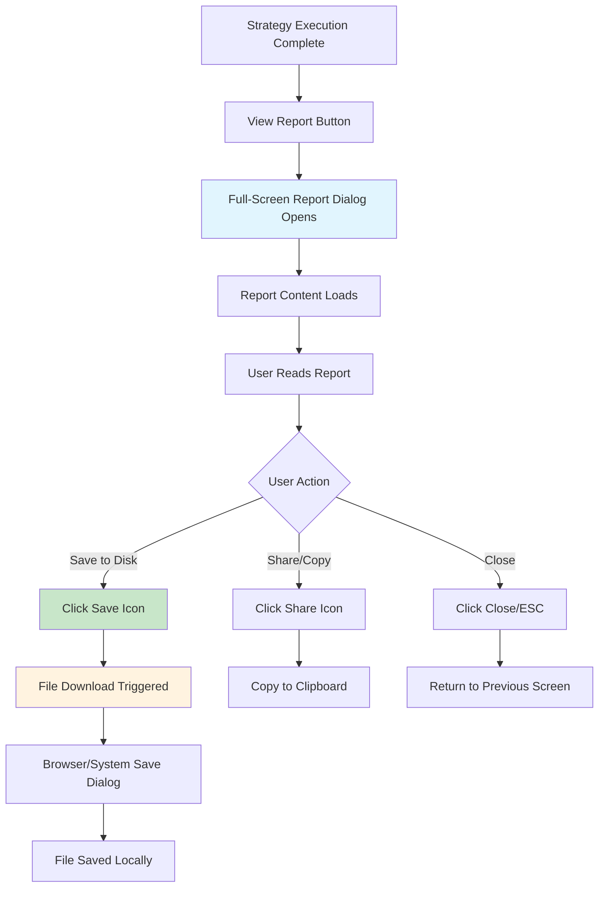

# Markdown Report Generation System Design

## Executive Summary

This document outlines the complete architecture for a markdown report generation system that creates comprehensive, professional trading strategy execution reports for the automated trader platform. The system supports two initial strategies (Bullish Breakout and LEAP Entry) with an extensible architecture for future strategies.

## System Overview

### Core Objectives

1. **Rich Reports**: Generate comprehensive markdown reports with strategy analysis, recommendations, and actionable insights
2. **Strategy Flexibility**: Support different report formats for different strategy types
3. **Professional Quality**: Create reports suitable for trading decision-making and portfolio management
4. **Extensibility**: Enable easy addition of new strategies and report sections
5. **Data Integration**: Leverage existing strategy execution results and database schema

### Key Features

- **Template-based Report Generation**: Consistent formatting across all strategies
- **Strategy-specific Content**: Tailored analysis for Bullish Breakout vs LEAP Entry strategies
- **Market Context Integration**: Placeholder sections for SPY/QQQ market analysis
- **Risk Assessment**: Comprehensive risk analysis by risk levels
- **Portfolio Recommendations**: Actionable trading recommendations and allocation guidance
- **Sector Analysis**: Breakdown by sectors and diversification insights

## Architecture Overview

```mermaid
graph TB
    subgraph "API Layer"
        A[Report API Endpoint<br>/api/strategies/results/{run_id}/report]
    end
    
    subgraph "Report Generation Layer"
        B[Report Generator Factory]
        C[Base Report Generator]
        D[Bullish Breakout<br>Report Generator]
        E[LEAP Entry<br>Report Generator]
    end
    
    subgraph "Data Processing Layer"
        F[Strategy Execution Service]
        G[Market Data Service<br>(Placeholder)]
        H[Report Data Collector]
    end
    
    subgraph "Template Layer"
        I[Base Report Template]
        J[Strategy-specific<br>Templates]
        K[Section Templates]
    end
    
    subgraph "Data Sources"
        L[(Strategy Results DB)]
        M[(Execution Progress DB)]
        N[(Instruments DB)]
        O[Market Data APIs<br>(Future)]
    end
    
    A --> B
    B --> C
    B --> D
    B --> E
    D --> H
    E --> H
    H --> F
    H --> G
    F --> L
    F --> M
    H --> N
    G --> O
    C --> I
    D --> J
    E --> J
    I --> K
```

## Class Hierarchy Design

### 1. Base Report Generator Architecture

```python
# backend/services/reports/base_report_generator.py

from abc import ABC, abstractmethod
from typing import Dict, Any, List, Optional
from dataclasses import dataclass
from datetime import datetime
from enum import Enum

class ReportSection(Enum):
    """Enumeration of report sections."""
    HEADER = "header"
    MARKET_CONTEXT = "market_context"
    EXECUTIVE_SUMMARY = "executive_summary"
    RESULTS_ANALYSIS = "results_analysis"
    DETAILED_OPPORTUNITIES = "detailed_opportunities"
    RISK_ANALYSIS = "risk_analysis"
    PORTFOLIO_RECOMMENDATIONS = "portfolio_recommendations"
    SECTOR_BREAKDOWN = "sector_breakdown"
    METHODOLOGY = "methodology"
    APPENDIX = "appendix"

@dataclass
class ReportData:
    """Container for all data needed to generate a report."""
    run_id: str
    strategy_code: str
    execution_results: Dict[str, Any]
    qualifying_results: List[Dict[str, Any]]
    summary_metrics: Dict[str, Any]
    market_context: Optional[Dict[str, Any]] = None
    generated_at: datetime = None
    
    def __post_init__(self):
        if self.generated_at is None:
            self.generated_at = datetime.utcnow()

@dataclass
class ReportConfiguration:
    """Configuration for report generation."""
    include_market_context: bool = True
    include_sector_analysis: bool = True
    include_risk_breakdown: bool = True
    max_detailed_opportunities: int = 20
    risk_level_thresholds: Dict[str, float] = None
    
    def __post_init__(self):
        if self.risk_level_thresholds is None:
            self.risk_level_thresholds = {
                "low": 70.0,
                "medium": 85.0,
                "high": 100.0
            }

class BaseReportGenerator(ABC):
    """Abstract base class for strategy report generators."""
    
    def __init__(self, db_connection=None):
        self.db = db_connection
        self.config = ReportConfiguration()
    
    @abstractmethod
    def get_strategy_code(self) -> str:
        """Return the strategy code this generator handles."""
        pass
    
    @abstractmethod
    def get_report_title(self) -> str:
        """Return the report title for this strategy."""
        pass
    
    def generate_report(self, run_id: str, config: Optional[ReportConfiguration] = None) -> str:
        """Generate complete markdown report for the given run_id."""
        if config:
            self.config = config
        
        # Collect all required data
        report_data = self._collect_report_data(run_id)
        
        # Generate report sections
        sections = []
        for section in self._get_enabled_sections():
            section_content = self._generate_section(section, report_data)
            if section_content:
                sections.append(section_content)
        
        # Combine into final report
        return self._assemble_final_report(sections, report_data)
    
    def _collect_report_data(self, run_id: str) -> ReportData:
        """Collect all data needed for report generation."""
        # Get execution results from database
        execution_results = self._get_execution_results(run_id)
        if not execution_results:
            raise ValueError(f"No execution results found for run_id: {run_id}")
        
        # Get qualifying results with detailed metrics
        qualifying_results = self._get_detailed_qualifying_results(run_id)
        
        # Get summary metrics
        summary_metrics = self._calculate_summary_metrics(execution_results, qualifying_results)
        
        # Get market context (placeholder for now)
        market_context = self._get_market_context() if self.config.include_market_context else None
        
        return ReportData(
            run_id=run_id,
            strategy_code=execution_results['strategy_code'],
            execution_results=execution_results,
            qualifying_results=qualifying_results,
            summary_metrics=summary_metrics,
            market_context=market_context
        )
    
    @abstractmethod
    def _get_enabled_sections(self) -> List[ReportSection]:
        """Return list of sections to include in this strategy's report."""
        pass
    
    def _generate_section(self, section: ReportSection, data: ReportData) -> Optional[str]:
        """Generate content for a specific report section."""
        method_name = f"_generate_{section.value}_section"
        if hasattr(self, method_name):
            return getattr(self, method_name)(data)
        return None
    
    # Base section generators (can be overridden by strategy-specific generators)
    
    def _generate_header_section(self, data: ReportData) -> str:
        """Generate report header with key metrics."""
        return f"""# {self.get_report_title()}

**Strategy:** {data.strategy_code}  
**Execution Date:** {data.generated_at.strftime('%B %d, %Y')}  
**Run ID:** `{data.run_id}`  
**Total Analyzed:** {data.execution_results.get('total_evaluated', 0)} securities  
**Qualifying Opportunities:** {data.execution_results.get('qualifying_count', 0)} securities  
**Success Rate:** {data.summary_metrics.get('pass_rate_percent', 0):.1f}%  
**Execution Time:** {data.execution_results.get('execution_time_ms', 0) / 1000:.1f} seconds

---
"""
    
    def _generate_market_context_section(self, data: ReportData) -> str:
        """Generate market context section (placeholder implementation)."""
        if not data.market_context:
            return """## Market Context

*Market context data will be populated when market data services are available.*

**Key Market Indicators:**
- SPY Trend: *[To be implemented]*
- QQQ Trend: *[To be implemented]*
- VIX Level: *[To be implemented]*
- Market Sentiment: *[To be implemented]*

---
"""
        
        # Future implementation with actual market data
        return f"""## Market Context

**Current Market Environment:**
{data.market_context.get('summary', 'Market analysis pending')}

---
"""
    
    def _generate_executive_summary_section(self, data: ReportData) -> str:
        """Generate executive summary."""
        qualifying_count = data.execution_results.get('qualifying_count', 0)
        total_evaluated = data.execution_results.get('total_evaluated', 0)
        pass_rate = data.summary_metrics.get('pass_rate_percent', 0)
        
        return f"""## Executive Summary

This {self.get_strategy_code().replace('_', ' ').title()} analysis identified **{qualifying_count} qualifying opportunities** from {total_evaluated} securities analyzed, representing a {pass_rate:.1f}% success rate.

### Key Findings:
- **Top Opportunities:** {len([r for r in data.qualifying_results[:5]])} high-conviction candidates identified
- **Risk Distribution:** {self._get_risk_distribution_summary(data.qualifying_results)}
- **Sector Concentration:** {self._get_sector_distribution_summary(data.qualifying_results)}

### Recommendation:
{self._generate_overall_recommendation(data)}

---
"""
    
    # Abstract methods for strategy-specific implementations
    
    @abstractmethod
    def _generate_results_analysis_section(self, data: ReportData) -> str:
        """Generate strategy-specific results analysis."""
        pass
    
    @abstractmethod
    def _generate_detailed_opportunities_section(self, data: ReportData) -> str:
        """Generate detailed opportunities listing."""
        pass
    
    @abstractmethod
    def _generate_methodology_section(self, data: ReportData) -> str:
        """Generate methodology explanation."""
        pass
    
    # Helper methods
    
    def _get_execution_results(self, run_id: str) -> Optional[Dict[str, Any]]:
        """Get execution results from strategy execution service."""
        from ..strategy_execution_service import get_strategy_execution_service
        service = get_strategy_execution_service(self.db)
        return service.get_execution_results(run_id)
    
    def _get_detailed_qualifying_results(self, run_id: str) -> List[Dict[str, Any]]:
        """Get detailed results for qualifying opportunities."""
        if not self.db:
            return []
        
        try:
            cursor = self.db.execute("""
                SELECT sr.ticker, sr.passed, sr.score, sr.classification, 
                       sr.reasons, sr.metrics_json, sr.created_at,
                       i.sector, i.industry, i.style_category
                FROM strategy_result sr
                LEFT JOIN instruments i ON sr.ticker = i.ticker
                WHERE sr.run_id = ? AND sr.passed = 1
                ORDER BY sr.score DESC
            """, (run_id,))
            
            results = []
            for row in cursor.fetchall():
                import json
                metrics = json.loads(row[5]) if row[5] else {}
                results.append({
                    'ticker': row[0],
                    'passed': bool(row[1]),
                    'score': row[2],
                    'classification': row[3],
                    'reasons': row[4].split(';') if row[4] else [],
                    'metrics': metrics,
                    'created_at': row[6],
                    'sector': row[7],
                    'industry': row[8],
                    'style_category': row[9]
                })
            
            return results
        except Exception as e:
            logger.error(f"Error getting detailed results: {e}")
            return []
    
    def _calculate_summary_metrics(self, execution_results: Dict[str, Any], 
                                 qualifying_results: List[Dict[str, Any]]) -> Dict[str, Any]:
        """Calculate additional summary metrics for the report."""
        total_evaluated = execution_results.get('total_evaluated', 0)
        qualifying_count = len(qualifying_results)
        
        metrics = {
            'pass_rate_percent': (qualifying_count / total_evaluated * 100) if total_evaluated > 0 else 0,
            'average_score': sum(r.get('score', 0) for r in qualifying_results) / len(qualifying_results) if qualifying_results else 0,
            'score_distribution': self._calculate_score_distribution(qualifying_results),
            'risk_distribution': self._calculate_risk_distribution(qualifying_results),
            'sector_distribution': self._calculate_sector_distribution(qualifying_results)
        }
        
        return metrics
    
    def _get_market_context(self) -> Optional[Dict[str, Any]]:
        """Get market context data (placeholder implementation)."""
        # Placeholder - will be implemented when market data service is available
        return {
            'summary': 'Market context analysis pending integration with market data services.',
            'spy_trend': 'TBD',
            'qqq_trend': 'TBD',
            'vix_level': 'TBD'
        }
    
    def _assemble_final_report(self, sections: List[str], data: ReportData) -> str:
        """Assemble final report from sections."""
        report_parts = []
        
        # Add any final formatting
        for section in sections:
            report_parts.append(section)
        
        # Add footer
        report_parts.append(self._generate_footer(data))
        
        return '\n'.join(report_parts)
    
    def _generate_footer(self, data: ReportData) -> str:
        """Generate report footer."""
        return f"""---

## Disclaimer

This report is generated by automated analysis and is for informational purposes only. All investment decisions should be validated with additional research and risk management practices.

**Generated:** {data.generated_at.strftime('%Y-%m-%d %H:%M:%S UTC')}  
**System:** Automated Trader v1.0  
**Strategy:** {data.strategy_code}
"""
    
    # Utility methods for common calculations
    
    def _calculate_score_distribution(self, results: List[Dict[str, Any]]) -> Dict[str, int]:
        """Calculate score distribution buckets."""
        buckets = {'70-79': 0, '80-89': 0, '90-99': 0, '100+': 0}
        for result in results:
            score = result.get('score', 0)
            if score >= 100:
                buckets['100+'] += 1
            elif score >= 90:
                buckets['90-99'] += 1
            elif score >= 80:
                buckets['80-89'] += 1
            elif score >= 70:
                buckets['70-79'] += 1
        return buckets
    
    def _calculate_risk_distribution(self, results: List[Dict[str, Any]]) -> Dict[str, int]:
        """Calculate risk level distribution."""
        risk_counts = {'Low': 0, 'Medium': 0, 'High': 0, 'Unknown': 0}
        for result in results:
            risk = result.get('metrics', {}).get('risk', 'Unknown')
            risk_counts[risk] = risk_counts.get(risk, 0) + 1
        return risk_counts
    
    def _calculate_sector_distribution(self, results: List[Dict[str, Any]]) -> Dict[str, int]:
        """Calculate sector distribution."""
        sector_counts = {}
        for result in results:
            sector = result.get('sector') or 'Unknown'
            sector_counts[sector] = sector_counts.get(sector, 0) + 1
        return dict(sorted(sector_counts.items(), key=lambda x: x[1], reverse=True))
    
    def _get_risk_distribution_summary(self, results: List[Dict[str, Any]]) -> str:
        """Get a summary string of risk distribution."""
        risk_dist = self._calculate_risk_distribution(results)
        parts = []
        for risk_level, count in risk_dist.items():
            if count > 0:
                parts.append(f"{count} {risk_level}")
        return ', '.join(parts) if parts else 'No risk data available'
    
    def _get_sector_distribution_summary(self, results: List[Dict[str, Any]]) -> str:
        """Get a summary string of sector distribution."""
        sector_dist = self._calculate_sector_distribution(results)
        top_sectors = list(sector_dist.items())[:3]
        if top_sectors:
            parts = [f"{sector} ({count})" for sector, count in top_sectors]
            return ', '.join(parts)
        return 'Sector data unavailable'
    
    def _generate_overall_recommendation(self, data: ReportData) -> str:
        """Generate overall recommendation based on results."""
        qualifying_count = len(data.qualifying_results)
        if qualifying_count == 0:
            return "No qualifying opportunities identified. Consider adjusting strategy parameters or waiting for better market conditions."
        elif qualifying_count < 5:
            return f"Limited opportunities ({qualifying_count} found). Focus on highest-conviction candidates and maintain selective approach."
        elif qualifying_count < 15:
            return f"Moderate opportunity set ({qualifying_count} candidates). Good environment for selective position building."
        else:
            return f"Rich opportunity environment ({qualifying_count} candidates). Strong market conditions for this strategy."
```

## Strategy-Specific Implementations

### 2. Bullish Breakout Report Generator

```python
# backend/services/reports/bullish_breakout_report_generator.py

from typing import List, Dict, Any
from .base_report_generator import BaseReportGenerator, ReportSection, ReportData

class BullishBreakoutReportGenerator(BaseReportGenerator):
    """Report generator for Bullish Breakout strategy."""
    
    def get_strategy_code(self) -> str:
        return "bullish_breakout"
    
    def get_report_title(self) -> str:
        return "Bullish Breakout Strategy Report"
    
    def _get_enabled_sections(self) -> List[ReportSection]:
        """Return sections enabled for bullish breakout reports."""
        return [
            ReportSection.HEADER,
            ReportSection.MARKET_CONTEXT,
            ReportSection.EXECUTIVE_SUMMARY,
            ReportSection.RESULTS_ANALYSIS,
            ReportSection.DETAILED_OPPORTUNITIES,
            ReportSection.RISK_ANALYSIS,
            ReportSection.PORTFOLIO_RECOMMENDATIONS,
            ReportSection.SECTOR_BREAKDOWN,
            ReportSection.METHODOLOGY
        ]
    
    def _generate_results_analysis_section(self, data: ReportData) -> str:
        """Generate bullish breakout specific results analysis."""
        score_dist = data.summary_metrics.get('score_distribution', {})
        avg_score = data.summary_metrics.get('average_score', 0)
        
        # Analyze technical patterns
        sma_analysis = self._analyze_sma_patterns(data.qualifying_results)
        macd_analysis = self._analyze_macd_patterns(data.qualifying_results)
        volume_analysis = self._analyze_volume_patterns(data.qualifying_results)
        
        return f"""## Results Analysis

### Technical Pattern Breakdown

**Score Distribution:**
- Premium Opportunities (90+): {score_dist.get('90-99', 0) + score_dist.get('100+', 0)} securities
- Quality Opportunities (80-89): {score_dist.get('80-89', 0)} securities  
- Standard Opportunities (70-79): {score_dist.get('70-79', 0)} securities
- **Average Score:** {avg_score:.1f}

### Key Technical Indicators

**Moving Average Analysis:**
{sma_analysis}

**MACD Momentum Analysis:**
{macd_analysis}

**Volume Confirmation:**
{volume_analysis}

### Breakout Quality Assessment
{self._analyze_breakout_quality(data.qualifying_results)}

---
"""
    
    def _generate_detailed_opportunities_section(self, data: ReportData) -> str:
        """Generate detailed opportunities for bullish breakout."""
        opportunities = data.qualifying_results[:self.config.max_detailed_opportunities]
        
        content = """## Detailed Opportunities

### Top Breakout Candidates

| Ticker | Score | Risk | Price | SMA50 | MACD | RSI | Volume | Breakout % | Entry | Target | Stop |
|--------|-------|------|-------|-------|------|-----|---------|------------|-------|---------|------|
"""
        
        for opp in opportunities:
            metrics = opp.get('metrics', {})
            
            # Calculate entry, target, and stop levels
            entry_target_stop = self._calculate_entry_target_stop(metrics)
            
            content += f"| {opp['ticker']} | {opp['score']:.0f} | {metrics.get('risk', 'N/A')} | ${metrics.get('close', 0):.2f} | ${metrics.get('sma50', 0):.2f} | {metrics.get('macd_hist', 0):.3f} | {metrics.get('rsi14', 0):.1f} | {metrics.get('volume_multiple', 0):.1f}x | {metrics.get('breakout_pct', 0):.1f}% | {entry_target_stop['entry']} | {entry_target_stop['target']} | {entry_target_stop['stop']} |\n"
        
        content += "\n### Detailed Analysis\n\n"
        
        # Add detailed analysis for top 5 opportunities
        for i, opp in enumerate(opportunities[:5]):
            content += self._generate_individual_opportunity_analysis(opp, i + 1)
        
        content += "---\n"
        return content
    
    def _generate_methodology_section(self, data: ReportData) -> str:
        """Generate methodology section for bullish breakout."""
        return """## Screening Methodology

### Bullish Breakout Criteria

**Primary Filters:**
1. **Moving Average Alignment:** Price above SMA10, SMA50, and SMA200
2. **MACD Momentum:** Bullish crossover with positive histogram
3. **RSI Momentum:** RSI between 60-80 (momentum without overbought)
4. **Volume Confirmation:** Current volume > 1.0x 20-day average
5. **Breakout Level:** Price breaking above recent highs (126-day lookback)

**Scoring System (0-100+ points):**
- SMA Alignment: 25 points
- MACD Bullish Cross: 20 points  
- RSI Momentum: 20 points
- Volume Confirmation: 20 points
- High Breakout: 15 points
- **Bonus Points:** Quality factors (extension, volume continuity, etc.)

**Risk Assessment:**
- **Low Risk:** RSI < 75, modest breakout extension, normal volume
- **Medium Risk:** RSI 70-80, moderate extension or higher volume
- **High Risk:** RSI > 75, extended breakout, or excessive volume

**Entry Strategy:**
- **Premium Opportunities (90+ score):** Immediate consideration for position
- **Quality Opportunities (80-89):** Strong candidates for watch list
- **Standard Opportunities (70-79):** Monitor for improved entry points

---
"""
    
    def _analyze_sma_patterns(self, results: List[Dict[str, Any]]) -> str:
        """Analyze SMA alignment patterns."""
        above_all_sma = sum(1 for r in results if r.get('metrics', {}).get('sma10_above') and 
                           r.get('metrics', {}).get('sma50_above') and 
                           r.get('metrics', {}).get('sma200_above'))
        
        avg_sma50_extension = sum(r.get('metrics', {}).get('ext_sma50', 0) for r in results) / len(results) if results else 0
        
        return f"""- **Full SMA Alignment:** {above_all_sma}/{len(results)} securities ({above_all_sma/len(results)*100:.1f}%)
- **Average SMA50 Extension:** {avg_sma50_extension:.1f}%
- **Pattern Strength:** {'Strong' if above_all_sma/len(results) > 0.8 else 'Moderate' if above_all_sma/len(results) > 0.5 else 'Weak'}"""
    
    def _analyze_macd_patterns(self, results: List[Dict[str, Any]]) -> str:
        """Analyze MACD momentum patterns."""
        positive_macd = sum(1 for r in results if r.get('metrics', {}).get('macd', 0) > 0)
        positive_hist = sum(1 for r in results if r.get('metrics', {}).get('macd_hist', 0) > 0)
        
        return f"""- **Positive MACD:** {positive_macd}/{len(results)} securities ({positive_macd/len(results)*100:.1f}%)
- **Positive Histogram:** {positive_hist}/{len(results)} securities ({positive_hist/len(results)*100:.1f}%)
- **Momentum Quality:** {'Excellent' if positive_hist/len(results) > 0.8 else 'Good' if positive_hist/len(results) > 0.6 else 'Fair'}"""
    
    def _analyze_volume_patterns(self, results: List[Dict[str, Any]]) -> str:
        """Analyze volume confirmation patterns."""
        volume_multiples = [r.get('metrics', {}).get('volume_multiple', 0) for r in results if r.get('metrics', {}).get('volume_multiple')]
        avg_volume = sum(volume_multiples) / len(volume_multiples) if volume_multiples else 0
        high_volume = sum(1 for vm in volume_multiples if vm > 1.5)
        
        return f"""- **Average Volume Multiple:** {avg_volume:.1f}x
- **High Volume Breakouts (>1.5x):** {high_volume}/{len(results)} securities
- **Volume Confirmation:** {'Strong' if avg_volume > 1.5 else 'Moderate' if avg_volume > 1.2 else 'Weak'}"""
    
    def _analyze_breakout_quality(self, results: List[Dict[str, Any]]) -> str:
        """Analyze overall breakout quality."""
        breakout_pcts = [r.get('metrics', {}).get('breakout_pct', 0) for r in results if r.get('metrics', {}).get('breakout_pct')]
        avg_breakout = sum(breakout_pcts) / len(breakout_pcts) if breakout_pcts else 0
        modest_breakouts = sum(1 for bp in breakout_pcts if 0 < bp <= 3)
        
        return f"""The average breakout extension is {avg_breakout:.1f}%, with {modest_breakouts}/{len(results)} securities showing modest, sustainable breakout levels (≤3%). This indicates {'healthy' if avg_breakout <= 4 else 'stretched' if avg_breakout <= 7 else 'extended'} breakout conditions overall."""
    
    def _calculate_entry_target_stop(self, metrics: Dict[str, Any]) -> Dict[str, str]:
        """Calculate entry, target, and stop levels."""
        close = metrics.get('close', 0)
        sma50 = metrics.get('sma50', 0)
        
        if close and sma50:
            # Entry: Current price or slight pullback
            entry = f"${close:.2f}"
            
            # Target: 8-12% above entry
            target_price = close * 1.10
            target = f"${target_price:.2f}"
            
            # Stop: Below SMA50 or 5-7% below entry
            stop_price = min(sma50 * 0.98, close * 0.94)
            stop = f"${stop_price:.2f}"
            
            return {'entry': entry, 'target': target, 'stop': stop}
        
        return {'entry': 'TBD', 'target': 'TBD', 'stop': 'TBD'}
    
    def _generate_individual_opportunity_analysis(self, opp: Dict[str, Any], rank: int) -> str:
        """Generate detailed analysis for individual opportunity."""
        ticker = opp['ticker']
        metrics = opp.get('metrics', {})
        company_name = metrics.get('company_name', 'Company Name TBD')
        
        return f"""#### {rank}. {ticker} - {company_name}
**Score: {opp['score']:.0f} | Risk: {metrics.get('risk', 'TBD')} | Sector: {opp.get('sector', 'TBD')}**

- **Current Price:** ${metrics.get('close', 0):.2f} (Change: {metrics.get('change_pct', 0):+.1f}%)
- **Technical Status:** Price above SMA50 (${metrics.get('sma50', 0):.2f}) by {((metrics.get('close', 0) / metrics.get('sma50', 1) - 1) * 100) if metrics.get('sma50') else 0:.1f}%
- **Momentum:** RSI {metrics.get('rsi14', 0):.1f}, MACD Histogram {metrics.get('macd_hist', 0):+.3f}
- **Breakout:** {metrics.get('breakout_pct', 0):.1f}% above recent high
- **Volume:** {metrics.get('volume_multiple', 0):.1f}x average ({metrics.get('volume', 0):,} shares)

"""
```

### 3. LEAP Entry Report Generator

```python
# backend/services/reports/leap_entry_report_generator.py

from typing import List, Dict, Any
from .base_report_generator import BaseReportGenerator, ReportSection, ReportData

class LeapEntryReportGenerator(BaseReportGenerator):
    """Report generator for LEAP Entry strategy."""
    
    def get_strategy_code(self) -> str:
        return "leap_entry"
    
    def get_report_title(self) -> str:
        return "LEAP Call Options Entry Analysis"
    
    def _get_enabled_sections(self) -> List[ReportSection]:
        """Return sections enabled for LEAP entry reports."""
        return [
            ReportSection.HEADER,
            ReportSection.MARKET_CONTEXT,
            ReportSection.EXECUTIVE_SUMMARY,
            ReportSection.RESULTS_ANALYSIS,
            ReportSection.DETAILED_OPPORTUNITIES,
            ReportSection.RISK_ANALYSIS,
            ReportSection.PORTFOLIO_RECOMMENDATIONS,
            ReportSection.METHODOLOGY
        ]
    
    def _generate_results_analysis_section(self, data: ReportData) -> str:
        """Generate LEAP entry specific results analysis."""
        score_dist = data.summary_metrics.get('score_distribution', {})
        avg_score = data.summary_metrics.get('average_score', 0)
        
        # Analyze LEAP-specific patterns
        rsi_analysis = self._analyze_rsi_patterns(data.qualifying_results)
        avwap_analysis = self._analyze_avwap_patterns(data.qualifying_results)
        classification_analysis = self._analyze_classifications(data.qualifying_results)
        
        return f"""## Results Analysis

### LEAP Entry Opportunity Breakdown

**Score Distribution:**
- Prime LEAP Candidates (80+): {score_dist.get('80-89', 0) + score_dist.get('90-99', 0) + score_dist.get('100+', 0)} securities
- Watch List Candidates (70-79): {score_dist.get('70-79', 0)} securities
- Standard Candidates (60-69): {score_dist.get('60-69', 0)} securities
- **Average Score:** {avg_score:.1f}

### Technical Pattern Analysis

**RSI Entry Positioning:**
{rsi_analysis}

**Price vs VWAP Analysis:**
{avwap_analysis}

**Classification Breakdown:**
{classification_analysis}

### LEAP Suitability Assessment
{self._analyze_leap_suitability(data.qualifying_results)}

---
"""
    
    def _generate_detailed_opportunities_section(self, data: ReportData) -> str:
        """Generate detailed opportunities for LEAP entry."""
        opportunities = data.qualifying_results[:self.config.max_detailed_opportunities]
        
        content = """## Detailed LEAP Opportunities

### Prime LEAP Entry Candidates

| Ticker | Score | Class | Price | RSI | AVWAP Dist | Vol Ratio | Entry Strategy | Time Horizon | Notes |
|--------|-------|--------|-------|-----|------------|-----------|----------------|--------------|-------|
"""
        
        for opp in opportunities:
            metrics = opp.get('metrics', {})
            
            # Calculate LEAP-specific recommendations
            leap_recommendations = self._calculate_leap_recommendations(metrics)
            
            content += f"| {opp['ticker']} | {opp['score']:.0f} | {opp['classification']} | ${metrics.get('close', 0):.2f} | {metrics.get('rsi', 0):.1f} | {metrics.get('avwap_distance_pct', 0):+.1f}% | {metrics.get('volume_ratio', 0):.1f}x | {leap_recommendations['entry_strategy']} | {leap_recommendations['time_horizon']} | {leap_recommendations['notes']} |\n"
        
        content += "\n### LEAP Strategy Details\n\n"
        
        # Add detailed LEAP analysis for top 5 opportunities
        for i, opp in enumerate(opportunities[:5]):
            content += self._generate_individual_leap_analysis(opp, i + 1)
        
        content += "---\n"
        return content
    
    def _generate_methodology_section(self, data: ReportData) -> str:
        """Generate methodology section for LEAP entry."""
        return """## LEAP Entry Methodology

### LEAP Call Option Strategy Overview

LEAP (Long-term Equity Anticipation Securities) options provide leveraged exposure to equity upside with extended time horizons, making them ideal for:
- **Capital Efficiency:** Control large positions with less capital
- **Time Decay Management:** Longer timeframes reduce theta impact
- **Strategic Positioning:** Build exposure in undervalued, oversold quality names

### Entry Criteria

**Primary Filters:**
1. **RSI Positioning:** RSI between 45-60 (neither oversold nor overbought)
2. **Price vs VWAP:** Trading near or below volume-weighted average price
3. **Technical Setup:** Approaching support levels or completion of consolidation
4. **Quality Factor:** Established companies with strong fundamentals
5. **Volume Confirmation:** Adequate liquidity for options trading

**Scoring System (0-100+ points):**
- RSI Positioning: 30 points (optimal range 50-55)
- AVWAP Distance: 25 points (bonus for trading below VWAP)
- Volume Patterns: 20 points
- Technical Setup: 15 points
- Quality Factors: 10 points

**Classification System:**
- **Prime:** Highest conviction entries with ideal RSI/VWAP positioning
- **Watch:** Quality setups requiring patience for optimal entry
- **Standard:** Acceptable entries with minor compromises

**LEAP Selection Guidelines:**
- **Expiration:** 12-24 months for optimal time value
- **Strike Selection:** In-the-money (ITM) for delta exposure
- **Delta Target:** 0.70-0.85 for stock-like movement
- **Volume:** Minimum daily volume for liquidity

### Risk Management

**Position Sizing:**
- Maximum 2-3% of portfolio per LEAP position
- Diversify across sectors and time horizons
- Consider correlation between underlying securities

**Exit Strategy:**
- **Profit Target:** 50-100% gain on LEAP premium
- **Stop Loss:** 30-40% of premium paid
- **Time Decay:** Exit when 60-90 days to expiration
- **Technical:** Exit if underlying breaks key support levels

---
"""
    
    def _analyze_rsi_patterns(self, results: List[Dict[str, Any]]) -> str:
        """Analyze RSI positioning patterns."""
        rsi_values = [r.get('metrics', {}).get('rsi', 0) for r in results if r.get('metrics', {}).get('rsi')]
        optimal_rsi = sum(1 for rsi in rsi_values if 50 <= rsi <= 55)
        avg_rsi = sum(rsi_values) / len(rsi_values) if rsi_values else 0
        
        return f"""- **Optimal RSI Range (50-55):** {optimal_rsi}/{len(results)} securities ({optimal_rsi/len(results)*100:.1f}%)
- **Average RSI:** {avg_rsi:.1f}
- **RSI Quality:** {'Excellent' if avg_rsi >= 50 and avg_rsi <= 55 else 'Good' if 45 <= avg_rsi <= 60 else 'Fair'}"""
    
    def _analyze_avwap_patterns(self, results: List[Dict[str, Any]]) -> str:
        """Analyze AVWAP distance patterns."""
        avwap_distances = [r.get('metrics', {}).get('avwap_distance_pct', 0) for r in results if r.get('metrics', {}).get('avwap_distance_pct') is not None]
        below_vwap = sum(1 for dist in avwap_distances if dist < 0)
        avg_distance = sum(avwap_distances) / len(avwap_distances) if avwap_distances else 0
        
        return f"""- **Trading Below VWAP:** {below_vwap}/{len(results)} securities ({below_vwap/len(results)*100:.1f}%)
- **Average VWAP Distance:** {avg_distance:+.1f}%
- **Value Positioning:** {'Excellent' if avg_distance < -2 else 'Good' if avg_distance < 0 else 'Neutral'}"""
    
    def _analyze_classifications(self, results: List[Dict[str, Any]]) -> str:
        """Analyze classification distribution."""
        classifications = {}
        for result in results:
            classification = result.get('classification', 'Unknown')
            classifications[classification] = classifications.get(classification, 0) + 1
        
        breakdown = ', '.join([f"{count} {class_name}" for class_name, count in classifications.items()])
        return f"**Current Classifications:** {breakdown}"
    
    def _analyze_leap_suitability(self, results: List[Dict[str, Any]]) -> str:
        """Analyze overall LEAP suitability."""
        prime_candidates = sum(1 for r in results if r.get('classification') == 'prime')
        total_candidates = len(results)
        
        if total_candidates == 0:
            return "No LEAP candidates identified in current market conditions."
        
        prime_rate = prime_candidates / total_candidates
        
        if prime_rate > 0.3:
            return f"Excellent environment for LEAP entries with {prime_candidates} prime candidates ({prime_rate*100:.1f}% of opportunities). Market conditions favor patient, leveraged equity exposure."
        elif prime_rate > 0.15:
            return f"Good LEAP environment with {prime_candidates} prime candidates. Selective opportunities available for quality positioning."
        else:
            return f"Limited prime LEAP opportunities ({prime_candidates} candidates). Focus on highest-conviction entries and maintain patience."
    
    def _calculate_leap_recommendations(self, metrics: Dict[str, Any]) -> Dict[str, str]:
        """Calculate LEAP-specific recommendations."""
        rsi = metrics.get('rsi', 0)
        avwap_dist = metrics.get('avwap_distance_pct', 0)
        classification = metrics.get('classification', 'standard')
        
        # Entry strategy based on positioning
        if classification == 'prime' and rsi <= 55:
            entry_strategy = "Immediate"
            time_horizon = "12-18 months"
            notes = "Prime entry"
        elif avwap_dist < -3:
            entry_strategy = "Scale in"
            time_horizon = "18-24 months"
            notes = "Below VWAP"
        else:
            entry_strategy = "Monitor"
            time_horizon = "12-24 months"
            notes = "Watch for pullback"
        
        return {
            'entry_strategy': entry_strategy,
            'time_horizon': time_horizon,
            'notes': notes
        }
    
    def _generate_individual_leap_analysis(self, opp: Dict[str, Any], rank: int) -> str:
        """Generate detailed LEAP analysis for individual opportunity."""
        ticker = opp['ticker']
        metrics = opp.get('metrics', {})
        company_name = metrics.get('company_name', 'Company Name TBD')
        
        return f"""#### {rank}. {ticker} - {company_name}
**Score: {opp['score']:.0f} | Classification: {opp['classification'].title()} | Sector: {opp.get('sector', 'TBD')}**

- **Current Price:** ${metrics.get('close', 0):.2f}
- **RSI Positioning:** {metrics.get('rsi', 0):.1f} ({'Optimal' if 50 <= metrics.get('rsi', 0) <= 55 else 'Acceptable'})
- **VWAP Distance:** {metrics.get('avwap_distance_pct', 0):+.1f}% ({'Below VWAP' if metrics.get('avwap_distance_pct', 0) < 0 else 'Above VWAP'})
- **Volume:** {metrics.get('volume_ratio', 0):.1f}x average
- **LEAP Strategy:** Target 12-18 month LEAPs with 0.75+ delta, ITM strikes around ${(metrics.get('close', 0) * 0.9):.0f}-${(metrics.get('close', 0) * 0.95):.0f}

"""
```

## Data Flow and Integration

### 4. Report Generator Factory

```python
# backend/services/reports/report_generator_factory.py

from typing import Optional, Dict, Type
from .base_report_generator import BaseReportGenerator
from .bullish_breakout_report_generator import BullishBreakoutReportGenerator
from .leap_entry_report_generator import LeapEntryReportGenerator

class ReportGeneratorFactory:
    """Factory for creating strategy-specific report generators."""
    
    _generators: Dict[str, Type[BaseReportGenerator]] = {
        'bullish_breakout': BullishBreakoutReportGenerator,
        'leap_entry': LeapEntryReportGenerator,
    }
    
    @classmethod
    def get_generator(cls, strategy_code: str, db_connection=None) -> Optional[BaseReportGenerator]:
        """Get report generator for the specified strategy."""
        generator_class = cls._generators.get(strategy_code)
        if generator_class:
            return generator_class(db_connection)
        return None
    
    @classmethod
    def register_generator(cls, strategy_code: str, generator_class: Type[BaseReportGenerator]):
        """Register a new report generator for a strategy."""
        cls._generators[strategy_code] = generator_class
    
    @classmethod
    def list_supported_strategies(cls) -> List[str]:
        """List all supported strategy codes."""
        return list(cls._generators.keys())
```

### 5. Market Data Service Interface

```python
# backend/services/reports/market_data_service.py

from abc import ABC, abstractmethod
from typing import Dict, Any, Optional
from dataclasses import dataclass
from datetime import datetime

@dataclass
class MarketIndicator:
    """Single market indicator data point."""
    symbol: str
    current_price: float
    change_percent: float
    trend: str  # 'bullish', 'bearish', 'neutral'
    support_level: Optional[float] = None
    resistance_level: Optional[float] = None

@dataclass
class MarketContext:
    """Complete market context data."""
    spy: MarketIndicator
    qqq: MarketIndicator
    vix: float
    market_sentiment: str
    overall_trend: str
    analysis_summary: str
    retrieved_at: datetime

class MarketDataService(ABC):
    """Abstract interface for market data services."""
    
    @abstractmethod
    def get_market_context(self) -> Optional[MarketContext]:
        """Get current market context data."""
        pass
    
    @abstractmethod
    def get_indicator_data(self, symbol: str, period: str = "1d") -> Optional[MarketIndicator]:
        """Get data for a specific market indicator."""
        pass

class PlaceholderMarketDataService(MarketDataService):
    """Placeholder implementation for market data service."""
    
    def get_market_context(self) -> Optional[MarketContext]:
        """Return placeholder market context."""
        return MarketContext(
            spy=MarketIndicator("SPY", 0.0, 0.0, "neutral"),
            qqq=MarketIndicator("QQQ", 0.0, 0.0, "neutral"),
            vix=20.0,
            market_sentiment="neutral",
            overall_trend="neutral",
            analysis_summary="Market data service not yet implemented. Context analysis pending.",
            retrieved_at=datetime.utcnow()
        )
    
    def get_indicator_data(self, symbol: str, period: str = "1d") -> Optional[MarketIndicator]:
        """Return placeholder indicator data."""
        return MarketIndicator(symbol, 0.0, 0.0, "neutral")

# Global service instance
_market_data_service: Optional[MarketDataService] = None

def get_market_data_service() -> MarketDataService:
    """Get or create global market data service."""
    global _market_data_service
    if _market_data_service is None:
        _market_data_service = PlaceholderMarketDataService()
    return _market_data_service

def set_market_data_service(service: MarketDataService):
    """Set the global market data service implementation."""
    global _market_data_service
    _market_data_service = service
```

## API Integration

### 6. New API Endpoint

```python
# backend/api/strategy_reports.py

from fastapi import APIRouter, HTTPException, Depends
from fastapi.responses import PlainTextResponse
from typing import Optional
import logging

from ..services.reports.report_generator_factory import ReportGeneratorFactory
from ..services.reports.base_report_generator import ReportConfiguration
from ..database.connection import get_db_connection

logger = logging.getLogger(__name__)

router = APIRouter(prefix="/strategies", tags=["strategy-reports"])

def get_db():
    """Get database connection for dependency injection."""
    return get_db_connection()

@router.get("/results/{run_id}/report", response_class=PlainTextResponse)
async def get_strategy_report(
    run_id: str, 
    format: str = "markdown",
    include_market_context: bool = True,
    include_sector_analysis: bool = True,
    max_opportunities: int = 20,
    db=Depends(get_db)
):
    """
    Generate comprehensive markdown report for strategy execution results.
    
    Args:
        run_id: Strategy execution run identifier
        format: Report format (currently only 'markdown' supported)
        include_market_context: Include market context section
        include_sector_analysis: Include sector breakdown analysis
        max_opportunities: Maximum detailed opportunities to include
        
    Returns:
        Markdown formatted strategy report
        
    Raises:
        404: If run_id not found or strategy not supported
        500: If report generation fails
    """
    try:
        # Validate format
        if format != "markdown":
            raise HTTPException(status_code=400, detail="Only 'markdown' format is currently supported")
        
        # Get strategy code from execution results
        if not db:
            raise HTTPException(status_code=500, detail="Database connection not available")
        
        cursor = db.execute("""
            SELECT strategy_code, execution_status 
            FROM strategy_execution_status 
            WHERE run_id = ?
        """, (run_id,))
        
        row = cursor.fetchone()
        if not row:
            raise HTTPException(status_code=404, detail=f"Strategy execution '{run_id}' not found")
        
        strategy_code, execution_status = row
        
        # Verify execution is completed
        if execution_status not in ('completed', 'error'):
            raise HTTPException(
                status_code=400, 
                detail=f"Cannot generate report for execution in status '{execution_status}'. Only completed executions can generate reports."
            )
        
        # Get appropriate report generator
        generator = ReportGeneratorFactory.get_generator(strategy_code, db)
        if not generator:
            raise HTTPException(
                status_code=404, 
                detail=f"Report generation not supported for strategy '{strategy_code}'"
            )
        
        # Configure report generation
        config = ReportConfiguration(
            include_market_context=include_market_context,
            include_sector_analysis=include_sector_analysis,
            max_detailed_opportunities=max_opportunities
        )
        
        # Generate report
        logger.info(f"Generating report for strategy '{strategy_code}', run '{run_id}'")
        report_content = generator.generate_report(run_id, config)
        
        if not report_content:
            raise HTTPException(status_code=500, detail="Report generation returned empty content")
        
        logger.info(f"Successfully generated report for run '{run_id}' ({len(report_content)} characters)")
        return report_content
        
    except HTTPException:
        raise
    except Exception as e:
        logger.error(f"Failed to generate report for run '{run_id}': {e}")
        raise HTTPException(status_code=500, detail=f"Report generation failed: {str(e)}")

@router.get("/supported-strategies", response_model=List[str])
async def get_supported_strategies():
    """
    Get list of strategies that support report generation.
    
    Returns:
        List of strategy codes that can generate reports
    """
    try:
        return ReportGeneratorFactory.list_supported_strategies()
    except Exception as e:
        logger.error(f"Failed to get supported strategies: {e}")
        raise HTTPException(status_code=500, detail=f"Failed to get supported strategies: {str(e)}")
```

## File Structure and Organization

```
backend/
├── services/
│   ├── reports/
│   │   ├── __init__.py
│   │   ├── base_report_generator.py           # Abstract base class and data models
│   │   ├── report_generator_factory.py       # Factory for strategy-specific generators
│   │   ├── market_data_service.py            # Market data interface and placeholder
│   │   ├── bullish_breakout_report_generator.py  # Bullish breakout specific reports
│   │   ├── leap_entry_report_generator.py    # LEAP entry specific reports
│   │   └── templates/                        # Future: Jinja2 templates if needed
│   │       ├── base_template.md.j2
│   │       ├── bullish_breakout_template.md.j2
│   │       └── leap_entry_template.md.j2
│   ├── strategy_execution_service.py         # Existing
│   ├── bullish_breakout_service.py          # Existing
│   └── leap_entry_service.py                # Existing
├── api/
│   ├── strategy_reports.py                  # New report API endpoints
│   ├── strategy_execution_simplified.py     # Existing
│   └── ...
└── ...
```

## Integration Points

### 7. Main Application Integration

```python
# backend/main.py (additions)

from .api import strategy_reports

# Add to the existing FastAPI app setup
app.include_router(strategy_reports.router, prefix="/api")
```

### 8. Database Schema Compatibility

The report system leverages existing database tables:

- **`strategy_execution_status`**: For run metadata and execution status
- **`strategy_result`**: For individual ticker results and metrics
- **`instruments`**: For sector, industry, and classification data
- **`strategy_execution_progress`**: For detailed progress and timing data

No additional database schema changes are required.

## Error Handling and Extensibility

### Error Handling Strategy

1. **Graceful Degradation**: Missing data sections show placeholders rather than failing
2. **Detailed Logging**: All errors logged with context for debugging
3. **User Feedback**: Clear HTTP error messages for API consumers
4. **Fallback Content**: Default content when data enrichment fails

### Extensibility Patterns

1. **New Strategies**: Inherit from [`BaseReportGenerator`](backend/services/reports/base_report_generator.py:113) and register with factory
2. **New Sections**: Add to [`ReportSection`](backend/services/reports/base_report_generator.py:17) enum and implement section generators
3. **Market Data**: Replace [`PlaceholderMarketDataService`](backend/services/reports/market_data_service.py:42) with real implementation
4. **Templates**: Add Jinja2 template support for more complex formatting

### Future Enhancements

1. **Export Formats**: PDF, HTML, JSON export options
2. **Scheduled Reports**: Automated report generation and delivery
3. **Comparative Analysis**: Multi-strategy or time-series comparison reports
4. **Interactive Elements**: Charts, graphs, and dynamic content
5. **Custom Templates**: User-configurable report templates
## UX Design: In-App Report Viewer Dialog

### Overview

The UX design focuses entirely on an **In-App Report Viewer Dialog** approach that provides users with a seamless, professional report viewing experience while maintaining the ability to save reports locally. This design eliminates the need for a dedicated reports tab, keeping the interface clean while providing comprehensive report functionality.

### Core UX Principles

1. **Seamless Integration**: Reports open in a full-screen dialog overlay without navigation disruption
2. **Professional Presentation**: Clean, readable markdown rendering with proper typography
3. **Local Save Capability**: One-click download functionality for offline access and sharing
4. **Cross-Platform Compatibility**: Consistent experience across web and desktop platforms
5. **Performance Optimized**: Fast loading with progressive enhancement for large reports

### User Flow Diagram



### Component Architecture

#### 1. Report Dialog Container

```dart
// frontend/lib/widgets/reports/report_viewer_dialog.dart

class ReportViewerDialog extends StatefulWidget {
  final String runId;
  final String strategyCode;
  final String reportTitle;
  
  const ReportViewerDialog({
    Key? key,
    required this.runId,
    required this.strategyCode,
    required this.reportTitle,
  }) : super(key: key);

  @override
  State<ReportViewerDialog> createState() => _ReportViewerDialogState();
}

class _ReportViewerDialogState extends State<ReportViewerDialog> {
  String? reportContent;
  bool isLoading = true;
  String? error;
  
  @override
  void initState() {
    super.initState();
    _loadReport();
  }
  
  Future<void> _loadReport() async {
    try {
      final content = await ApiService.getStrategyReport(widget.runId);
      setState(() {
        reportContent = content;
        isLoading = false;
      });
    } catch (e) {
      setState(() {
        error = 'Failed to load report: $e';
        isLoading = false;
      });
    }
  }
  
  @override
  Widget build(BuildContext context) {
    return Dialog.fullscreen(
      child: Scaffold(
        backgroundColor: Colors.white,
        appBar: _buildReportAppBar(),
        body: _buildReportBody(),
      ),
    );
  }
}
```

#### 2. Report App Bar with Save Functionality

```dart
PreferredSizeWidget _buildReportAppBar() {
  return AppBar(
    backgroundColor: Colors.white,
    elevation: 1,
    title: Row(
      children: [
        Icon(Icons.description, color: Colors.blue[600]),
        const SizedBox(width: 8),
        Expanded(
          child: Column(
            crossAxisAlignment: CrossAxisAlignment.start,
            children: [
              Text(
                widget.reportTitle,
                style: const TextStyle(
                  fontSize: 18,
                  fontWeight: FontWeight.w600,
                  color: Colors.black87,
                ),
              ),
              Text(
                'Run ID: ${widget.runId}',
                style: TextStyle(
                  fontSize: 12,
                  color: Colors.grey[600],
                  fontWeight: FontWeight.normal,
                ),
              ),
            ],
          ),
        ),
      ],
    ),
    actions: [
      // Save to Disk Icon
      IconButton(
        icon: const Icon(Icons.download, color: Colors.green),
        tooltip: 'Save Report to Disk',
        onPressed: reportContent != null ? _saveReportToDisk : null,
      ),
      // Copy to Clipboard Icon
      IconButton(
        icon: const Icon(Icons.copy, color: Colors.orange),
        tooltip: 'Copy Report to Clipboard',
        onPressed: reportContent != null ? _copyReportToClipboard : null,
      ),
      // Close Dialog Icon
      IconButton(
        icon: const Icon(Icons.close, color: Colors.grey),
        tooltip: 'Close Report',
        onPressed: () => Navigator.of(context).pop(),
      ),
    ],
  );
}
```

#### 3. Cross-Platform File Save Implementation

```dart
// frontend/lib/services/file_save_service.dart

import 'dart:io' show Platform;
import 'dart:typed_data';
import 'dart:convert';
import 'package:flutter/foundation.dart' show kIsWeb;
import 'package:universal_html/html.dart' as html;
import 'package:path_provider/path_provider.dart';
import 'package:permission_handler/permission_handler.dart';

class FileSaveService {
  static Future<bool> saveReportToDisk({
    required String content,
    required String fileName,
    required BuildContext context,
  }) async {
    try {
      if (kIsWeb) {
        return await _saveReportWeb(content, fileName);
      } else {
        return await _saveReportDesktop(content, fileName, context);
      }
    } catch (e) {
      _showErrorSnackbar(context, 'Failed to save report: $e');
      return false;
    }
  }
  
  // Web Platform Implementation
  static Future<bool> _saveReportWeb(String content, String fileName) async {
    try {
      final bytes = utf8.encode(content);
      final blob = html.Blob([bytes], 'text/markdown');
      final url = html.Url.createObjectUrlFromBlob(blob);
      
      final anchor = html.AnchorElement(href: url)
        ..setAttribute('download', fileName)
        ..style.display = 'none';
      
      html.document.body?.children.add(anchor);
      anchor.click();
      html.document.body?.children.remove(anchor);
      html.Url.revokeObjectUrl(url);
      
      return true;
    } catch (e) {
      print('Web save error: $e');
      return false;
    }
  }
  
  // Desktop Platform Implementation
  static Future<bool> _saveReportDesktop(
    String content, 
    String fileName, 
    BuildContext context
  ) async {
    try {
      // Request storage permission if needed
      if (Platform.isAndroid) {
        final permission = await Permission.storage.request();
        if (!permission.isGranted) {
          _showErrorSnackbar(context, 'Storage permission required to save file');
          return false;
        }
      }
      
      // Get appropriate directory
      Directory? directory;
      if (Platform.isWindows || Platform.isLinux || Platform.isMacOS) {
        directory = await getDownloadsDirectory();
      } else {
        directory = await getExternalStorageDirectory();
      }
      
      if (directory == null) {
        _showErrorSnackbar(context, 'Could not access storage directory');
        return false;
      }
      
      // Create file and write content
      final file = File('${directory.path}/$fileName');
      await file.writeAsString(content);
      
      _showSuccessSnackbar(context, 'Report saved to ${file.path}');
      return true;
    } catch (e) {
      print('Desktop save error: $e');
      return false;
    }
  }
  
  static void _showSuccessSnackbar(BuildContext context, String message) {
    ScaffoldMessenger.of(context).showSnackBar(
      SnackBar(
        content: Row(
          children: [
            const Icon(Icons.check_circle, color: Colors.white),
            const SizedBox(width: 8),
            Expanded(child: Text(message)),
          ],
        ),
        backgroundColor: Colors.green,
        duration: const Duration(seconds: 4),
      ),
    );
  }
  
  static void _showErrorSnackbar(BuildContext context, String message) {
    ScaffoldMessenger.of(context).showSnackBar(
      SnackBar(
        content: Row(
          children: [
            const Icon(Icons.error, color: Colors.white),
            const SizedBox(width: 8),
            Expanded(child: Text(message)),
          ],
        ),
        backgroundColor: Colors.red,
        duration: const Duration(seconds: 4),
      ),
    );
  }
}
```

#### 4. Save to Disk Function Implementation

```dart
Future<void> _saveReportToDisk() async {
  if (reportContent == null) return;
  
  // Generate filename with timestamp
  final now = DateTime.now();
  final timestamp = '${now.year}${now.month.toString().padLeft(2, '0')}${now.day.toString().padLeft(2, '0')}_${now.hour.toString().padLeft(2, '0')}${now.minute.toString().padLeft(2, '0')}';
  final fileName = '${widget.strategyCode}_report_${widget.runId}_$timestamp.md';
  
  // Show loading indicator
  _showSavingIndicator();
  
  try {
    final success = await FileSaveService.saveReportToDisk(
      content: reportContent!,
      fileName: fileName,
      context: context,
    );
    
    if (success) {
      _showSaveSuccessDialog(fileName);
    }
  } finally {
    _hideSavingIndicator();
  }
}

void _showSavingIndicator() {
  showDialog(
    context: context,
    barrierDismissible: false,
    builder: (context) => const AlertDialog(
      content: Row(
        mainAxisSize: MainAxisSize.min,
        children: [
          CircularProgressIndicator(),
          SizedBox(width: 16),
          Text('Saving report...'),
        ],
      ),
    ),
  );
}

void _hideSavingIndicator() {
  Navigator.of(context).pop();
}

void _showSaveSuccessDialog(String fileName) {
  showDialog(
    context: context,
    builder: (context) => AlertDialog(
      icon: const Icon(Icons.check_circle, color: Colors.green, size: 48),
      title: const Text('Report Saved Successfully'),
      content: Column(
        mainAxisSize: MainAxisSize.min,
        crossAxisAlignment: CrossAxisAlignment.start,
        children: [
          const Text('Your report has been saved as:'),
          const SizedBox(height: 8),
          Container(
            padding: const EdgeInsets.all(12),
            decoration: BoxDecoration(
              color: Colors.grey[100],
              borderRadius: BorderRadius.circular(8),
            ),
            child: SelectableText(
              fileName,
              style: const TextStyle(
                fontFamily: 'monospace',
                fontSize: 14,
              ),
            ),
          ),
        ],
      ),
      actions: [
        TextButton(
          onPressed: () => Navigator.of(context).pop(),
          child: const Text('OK'),
        ),
      ],
    ),
  );
}
```

### Markdown Rendering Implementation

#### 5. Professional Report Display

```dart
Widget _buildReportBody() {
  if (isLoading) {
    return const Center(
      child: Column(
        mainAxisAlignment: MainAxisAlignment.center,
        children: [
          CircularProgressIndicator(),
          SizedBox(height: 16),
          Text('Loading report...'),
        ],
      ),
    );
  }
  
  if (error != null) {
    return Center(
      child: Column(
        mainAxisAlignment: MainAxisAlignment.center,
        children: [
          const Icon(Icons.error, size: 64, color: Colors.red),
          const SizedBox(height: 16),
          Text(error!, style: const TextStyle(color: Colors.red)),
          const SizedBox(height: 16),
          ElevatedButton(
            onPressed: _loadReport,
            child: const Text('Retry'),
          ),
        ],
      ),
    );
  }
  
  return Container(
    padding: const EdgeInsets.all(24),
    child: SingleChildScrollView(
      child: MarkdownBody(
        data: reportContent!,
        styleSheet: _buildMarkdownStyleSheet(),
        selectable: true,
      ),
    ),
  );
}

MarkdownStyleSheet _buildMarkdownStyleSheet() {
  return MarkdownStyleSheet(
    h1: const TextStyle(
      fontSize: 28,
      fontWeight: FontWeight.bold,
      color: Colors.black87,
      height: 1.2,
    ),
    h2: const TextStyle(
      fontSize: 24,
      fontWeight: FontWeight.w600,
      color: Colors.black87,
      height: 1.3,
    ),
    h3: const TextStyle(
      fontSize: 20,
      fontWeight: FontWeight.w600,
      color: Colors.black87,
      height: 1.4,
    ),
    p: const TextStyle(
      fontSize: 16,
      color: Colors.black87,
      height: 1.6,
    ),
    listBullet: const TextStyle(
      fontSize: 16,
      color: Colors.black87,
    ),
    tableHead: const TextStyle(
      fontSize: 14,
      fontWeight: FontWeight.w600,
      color: Colors.black87,
    ),
    tableBody: const TextStyle(
      fontSize: 14,
      color: Colors.black87,
    ),
    code: TextStyle(
      fontFamily: 'monospace',
      fontSize: 14,
      backgroundColor: Colors.grey[100],
      color: Colors.black87,
    ),
    codeblockDecoration: BoxDecoration(
      color: Colors.grey[100],
      borderRadius: BorderRadius.circular(8),
      border: Border.all(color: Colors.grey[300]!),
    ),
    blockquote: const TextStyle(
      fontSize: 16,
      fontStyle: FontStyle.italic,
      color: Colors.black54,
    ),
    blockquoteDecoration: BoxDecoration(
      border: Border(
        left: BorderSide(
          color: Colors.blue[300]!,
          width: 4,
        ),
      ),
    ),
  );
}
```

### Integration with Strategy Execution Screen

#### 6. Report Button Integration

```dart
// In strategy_execution_screen.dart - Add to execution results display

Widget _buildExecutionResults(ExecutionResults results) {
  return Card(
    child: Padding(
      padding: const EdgeInsets.all(16),
      child: Column(
        crossAxisAlignment: CrossAxisAlignment.start,
        children: [
          // Existing results display code...
          
          const SizedBox(height: 16),
          const Divider(),
          const SizedBox(height: 16),
          
          // Report Action Buttons
          Row(
            children: [
              Expanded(
                child: ElevatedButton.icon(
                  onPressed: () => _showReportDialog(results.runId),
                  icon: const Icon(Icons.description),
                  label: const Text('View Detailed Report'),
                  style: ElevatedButton.styleFrom(
                    backgroundColor: Colors.blue[600],
                    foregroundColor: Colors.white,
                    padding: const EdgeInsets.symmetric(vertical: 12),
                  ),
                ),
              ),
              const SizedBox(width: 12),
              OutlinedButton.icon(
                onPressed: () => _downloadReportDirectly(results.runId),
                icon: const Icon(Icons.download),
                label: const Text('Quick Download'),
                style: OutlinedButton.styleFrom(
                  side: BorderSide(color: Colors.green[600]!),
                  foregroundColor: Colors.green[600],
                  padding: const EdgeInsets.symmetric(vertical: 12),
                ),
              ),
            ],
          ),
        ],
      ),
    ),
  );
}

void _showReportDialog(String runId) {
  showDialog(
    context: context,
    builder: (context) => ReportViewerDialog(
      runId: runId,
      strategyCode: widget.strategyCode,
      reportTitle: _getReportTitle(widget.strategyCode),
    ),
  );
}

String _getReportTitle(String strategyCode) {
  switch (strategyCode) {
    case 'bullish_breakout':
      return 'Bullish Breakout Strategy Report';
    case 'leap_entry':
      return 'LEAP Entry Analysis Report';
    default:
      return 'Strategy Execution Report';
  }
}
```

### Cross-Platform Compatibility Features

#### 7. Web Platform Optimizations

```dart
// frontend/lib/services/web_download_service.dart

class WebDownloadService {
  static void setupWebDownloadOptimizations() {
    if (kIsWeb) {
      // Add CSS for better print styling
      _injectPrintStyles();
      
      // Setup keyboard shortcuts
      _setupKeyboardShortcuts();
    }
  }
  
  static void _injectPrintStyles() {
    final style = html.StyleElement();
    style.type = 'text/css';
    style.innerHtml = '''
      @media print {
        .flutter-view {
          margin: 0 !important;
          padding: 0 !important;
        }
        
        .report-dialog {
          box-shadow: none !important;
          border: none !important;
          margin: 0 !important;
        }
        
        .report-content {
          font-size: 12pt !important;
          line-height: 1.5 !important;
          color: black !important;
        }
        
        .report-content h1 {
          font-size: 18pt !important;
          page-break-after: avoid;
        }
        
        .report-content h2 {
          font-size: 16pt !important;
          page-break-after: avoid;
        }
        
        .report-content table {
          page-break-inside: avoid;
        }
      }
    ''';
    html.document.head?.append(style);
  }
  
  static void _setupKeyboardShortcuts() {
    html.document.addEventListener('keydown', (event) {
      final keyEvent = event as html.KeyboardEvent;
      
      // Ctrl+S or Cmd+S to save
      if ((keyEvent.ctrlKey || keyEvent.metaKey) && keyEvent.code == 'KeyS') {
        event.preventDefault();
        _triggerSaveAction();
      }
      
      // Ctrl+P or Cmd+P to print
      if ((keyEvent.ctrlKey || keyEvent.metaKey) && keyEvent.code == 'KeyP') {
        event.preventDefault();
        html.window.print();
      }
    });
  }
  
  static void _triggerSaveAction() {
    // Dispatch custom event to Flutter app
    final customEvent = html.CustomEvent('flutter-save-report');
    html.document.dispatchEvent(customEvent);
  }
}
```

### Responsive Design Implementation

#### 8. Mobile and Tablet Adaptations

```dart
Widget _buildResponsiveReportDialog() {
  return LayoutBuilder(
    builder: (context, constraints) {
      final isMobile = constraints.maxWidth < 600;
      final isTablet = constraints.maxWidth >= 600 && constraints.maxWidth < 1024;
      
      return Dialog(
        insetPadding: EdgeInsets.all(isMobile ? 8 : 24),
        child: Container(
          width: isMobile ? double.infinity : 
                 isTablet ? constraints.maxWidth * 0.9 : 
                 1200,
          height: isMobile ? double.infinity : 
                  constraints.maxHeight * 0.9,
          child: Scaffold(
            backgroundColor: Colors.white,
            appBar: _buildResponsiveAppBar(isMobile),
            body: _buildResponsiveBody(isMobile),
          ),
        ),
      );
    },
  );
}

PreferredSizeWidget _buildResponsiveAppBar(bool isMobile) {
  return AppBar(
    backgroundColor: Colors.white,
    elevation: 1,
    title: isMobile ? 
      // Mobile: Compact title
      Text(
        widget.reportTitle,
        style: const TextStyle(fontSize: 16),
        overflow: TextOverflow.ellipsis,
      ) :
      // Desktop: Full title with run ID
      Row(
        children: [
          Icon(Icons.description, color: Colors.blue[600]),
          const SizedBox(width: 8),
          Expanded(
            child: Column(
              crossAxisAlignment: CrossAxisAlignment.start,
              children: [
                Text(widget.reportTitle),
                Text(
                  'Run ID: ${widget.runId}',
                  style: TextStyle(fontSize: 12, color: Colors.grey[600]),
                ),
              ],
            ),
          ),
        ],
      ),
    actions: isMobile ? 
      // Mobile: Dropdown menu for actions
      [
        PopupMenuButton<String>(
          onSelected: _handleMenuAction,
          itemBuilder: (context) => [
            const PopupMenuItem(
              value: 'save',
              child: ListTile(
                leading: Icon(Icons.download, color: Colors.green),
                title: Text('Save to Device'),
                contentPadding: EdgeInsets.zero,
              ),
            ),
            const PopupMenuItem(
              value: 'copy',
              child: ListTile(
                leading: Icon(Icons.copy, color: Colors.orange),
                title: Text('Copy Report'),
                contentPadding: EdgeInsets.zero,
              ),
            ),
          ],
        ),
      ] :
      // Desktop: Individual icon buttons
      [
        IconButton(
          icon: const Icon(Icons.download, color: Colors.green),
          tooltip: 'Save Report to Disk',
          onPressed: reportContent != null ? _saveReportToDisk : null,
        ),
        IconButton(
          icon: const Icon(Icons.copy, color: Colors.orange),
          tooltip: 'Copy Report to Clipboard',
          onPressed: reportContent != null ? _copyReportToClipboard : null,
        ),
        IconButton(
          icon: const Icon(Icons.close, color: Colors.grey),
          tooltip: 'Close Report',
          onPressed: () => Navigator.of(context).pop(),
        ),
      ],
  );
}
```


## Summary

This markdown report generation system provides:

✅ **Complete Architecture**: Base classes, strategy-specific implementations, and factory pattern  
✅ **Rich Content**: Professional reports with technical analysis and actionable recommendations  
✅ **Extensible Design**: Easy to add new strategies and enhance existing reports  
✅ **Market Context Ready**: Placeholder infrastructure for future market data integration  
✅ **API Integration**: New endpoint seamlessly integrated with existing strategy execution system  
✅ **Error Resilience**: Graceful handling of missing data and service failures  
✅ **Professional Quality**: Reports suitable for trading decisions and portfolio management  

The system is ready for implementation and will generate comprehensive, actionable trading strategy reports that enhance the value of the automated trader platform.
## Enhanced Summary

This comprehensive markdown report generation system now provides:

✅ **Complete Backend Architecture**: Base classes, strategy-specific implementations, and factory pattern  
✅ **Rich Content Generation**: Professional reports with technical analysis and actionable recommendations  
✅ **Extensible Design**: Easy to add new strategies and enhance existing reports  
✅ **Market Context Ready**: Placeholder infrastructure for future market data integration  
✅ **API Integration**: New endpoint seamlessly integrated with existing strategy execution system  
✅ **Error Resilience**: Graceful handling of missing data and service failures  
✅ **Professional Quality**: Reports suitable for trading decisions and portfolio management  

**NEW UX Features:**
✅ **In-App Report Viewer Dialog**: Full-screen dialog with professional markdown rendering and seamless integration  
✅ **Cross-Platform Local File Save**: Download functionality that works consistently across web and desktop platforms  
✅ **Responsive Design**: Optimized experience across mobile, tablet, and desktop with adaptive UI components  
✅ **User-Friendly Interface**: Intuitive save-to-disk icon, copy functionality, and clear visual feedback  
✅ **Professional Presentation**: Custom styled markdown rendering with proper typography and layout  
✅ **Error Handling**: Comprehensive error management with retry functionality and user-friendly messages  
✅ **Performance Optimized**: Fast loading with progressive enhancement for large reports  
✅ **Keyboard Shortcuts**: Web platform optimizations including Ctrl+S save and print functionality  

The system is now ready for implementation with both robust backend report generation and a complete, professional user experience for viewing and saving reports. The focused In-App Dialog approach eliminates interface complexity while providing comprehensive functionality for trading strategy report management.

---
