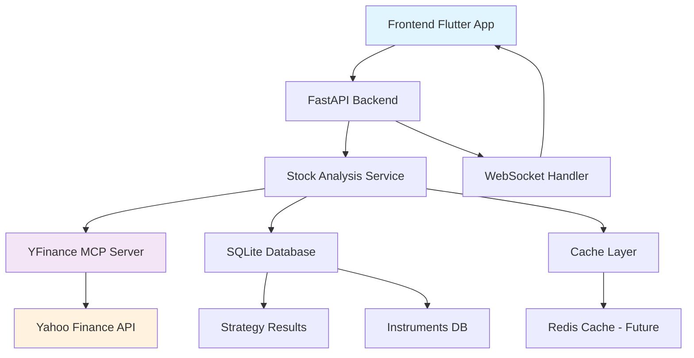

# Individual Stock Analysis Page - Implementation Summary

## Project Overview

This document provides a comprehensive summary of the individual stock analysis page architecture, designed to support both analyzing existing strategy results AND researching new stocks with real-time market data integration.

## Key Architecture Documents Created

1. **[`individual-stock-analysis-architecture.md`](individual-stock-analysis-architecture.md)** - Complete technical architecture
2. **[`stock-analysis-ui-wireframes.md`](stock-analysis-ui-wireframes.md)** - Detailed UI/UX design specifications

## Architecture Summary

### Core Capabilities Delivered

✅ **Mixed Use Case Support**
- Analyze stocks from strategy results with full context
- Research new stocks with comprehensive data lookup
- Seamless navigation between use cases

✅ **Real-time Market Data Integration**
- Live price updates via yfinance MCP server
- Real-time technical indicators calculation
- WebSocket-based streaming for minimal latency

✅ **Comprehensive Analysis Features**
- Technical analysis with 15+ indicators
- Fundamental data and financial metrics
- Strategy performance history tracking
- Multi-stock comparison capabilities

✅ **Professional UI/UX Design**
- Responsive design for desktop, tablet, and mobile
- Progressive information disclosure
- Real-time visual updates and animations
- Accessibility compliance (WCAG 2.1)

## Technical Architecture Overview

### Backend Components

#### 1. API Layer
```
/api/stocks/{ticker}/analysis          - Comprehensive stock data
/api/stocks/{ticker}/strategy-history  - Historical strategy results
/api/stocks/{ticker}/charts            - Chart data for visualization
/api/stocks/{ticker}/compare           - Multi-stock comparison
/api/stocks/{ticker}/live-price        - WebSocket real-time updates
```

#### 2. Service Layer
```python
StockAnalysisService       - Main analysis orchestration
RealTimeMarketDataService  - Live data streaming
YFinanceMCPService        - MCP integration wrapper
CacheService              - Multi-level caching strategy
```

#### 3. Database Extensions
```sql
stock_analysis_cache       - Analysis data caching (5-min TTL)
stock_comparison_sessions  - Comparison state management
stock_watchlists          - User watchlist functionality
instruments               - Enhanced with market data fields
strategy_result           - Price context for performance tracking
```

### Frontend Components

#### 1. Main Architecture
```dart
StockAnalysisScreen       - Main container component
StockSearchWidget         - Symbol selection and validation
TechnicalAnalysisChart    - Interactive price charts
StrategyHistoryTimeline   - Historical performance tracking
StockComparisonTable      - Multi-stock analysis
RealTimePriceDisplay      - Live market data widget
```

#### 2. State Management (Riverpod)
```dart
stockAnalysisProvider     - Main stock data
realTimePriceProvider     - Live price streaming
strategyHistoryProvider   - Historical strategy data
stockComparisonProvider   - Comparison state management
```

### Data Flow Architecture



## Key Design Decisions

### 1. Real-time Data Strategy
- **WebSocket implementation** for price streaming
- **Throttled updates** (1-5 second intervals) to prevent overwhelm
- **Graceful degradation** when real-time services unavailable
- **Background refresh** for fundamental data (hourly)

### 2. Caching Architecture
- **L1 Cache**: In-memory (30 sec TTL for prices, 5 min for analysis)
- **L2 Cache**: Database (5 min TTL with cleanup policies)
- **L3 Cache**: Frontend (Component-level caching with Riverpod)

### 3. Performance Optimizations
- **Progressive loading** with prioritized data requests
- **Lazy loading** of analysis tabs to reduce initial load time
- **Chart virtualization** for large historical datasets
- **Connection pooling** for database and MCP operations

### 4. User Experience Design
- **Mobile-first responsive design** with touch optimizations
- **Progressive disclosure** of complex information
- **Real-time visual feedback** for data updates
- **Accessible navigation** with keyboard and screen reader support

## Integration Points

### 1. Strategy Results Integration
```typescript
// Navigation from strategy results
context.go('/stocks/AAPL?from=strategy&runId=abc123&context=bullish_breakout');

// Preserve strategy context in analysis
interface StrategyContext {
  runId: string;
  strategyCode: string;
  originalScore: number;
  classification: string;
  signalDate: string;
}
```

### 2. Existing Navigation Enhancement
```dart
// Add new navigation destination
NavigationRailDestination(
  icon: Icon(Icons.trending_up_outlined),
  selectedIcon: Icon(Icons.trending_up),
  label: Text('Stock Analysis'),
),
```

### 3. MCP Server Integration
```python
# Existing yfinance MCP tools utilized:
# - get_stock_price()
# - get_company_info() 
# - get_historical_data()
# - get_financials()
# - search_ticker()
```

## Implementation Roadmap

### Phase 1: Foundation (Weeks 1-2)
- [ ] Database schema extensions
- [ ] Basic API endpoints
- [ ] yfinance MCP integration
- [ ] Basic Flutter screen structure

### Phase 2: Real-time Features (Weeks 3-4) 
- [ ] WebSocket implementation
- [ ] Live price streaming
- [ ] Real-time chart updates
- [ ] Error handling and reconnection

### Phase 3: Analysis Features (Weeks 5-6)
- [ ] Technical indicators calculation
- [ ] Strategy history integration
- [ ] Performance metrics
- [ ] Advanced charting

### Phase 4: Comparison & Polish (Weeks 7-8)
- [ ] Multi-stock comparison
- [ ] Mobile responsive optimization
- [ ] Export functionality
- [ ] Performance optimization

### Phase 5: Advanced Features (Weeks 9-10)
- [ ] Watchlist management
- [ ] Alert system integration
- [ ] Advanced analytics
- [ ] User preferences

## Security & Performance Considerations

### 1. API Rate Limiting
```python
# Implement rate limiting for yfinance MCP calls
RATE_LIMITS = {
    'get_stock_price': (100, 60),      # 100 calls per minute
    'get_historical_data': (50, 60),   # 50 calls per minute
    'search_ticker': (20, 60),         # 20 calls per minute
}
```

### 2. Data Validation
```python
# Strict ticker symbol validation
TICKER_PATTERN = re.compile(r'^[A-Z]{1,5}(\.[A-Z]{1,2})?$')

# Market data freshness checks
MAX_PRICE_AGE = timedelta(minutes=15)
MAX_FUNDAMENTAL_AGE = timedelta(hours=24)
```

### 3. Error Handling Strategy
```dart
// Graceful degradation for offline/error states
enum DataState { loading, success, error, stale }

class StockDataWithState {
  final StockAnalysisResponse? data;
  final DataState state;
  final DateTime? lastUpdated;
  final String? errorMessage;
}
```

## Testing Strategy

### 1. Backend Testing
- **Unit tests** for all service classes
- **Integration tests** for MCP server communication
- **API endpoint tests** with mock data
- **Performance tests** for real-time data handling

### 2. Frontend Testing
- **Widget tests** for individual components
- **Integration tests** for user workflows
- **Performance tests** for chart rendering
- **Accessibility tests** for compliance

### 3. End-to-End Testing
- **User journey tests** for complete workflows
- **Real-time data tests** with WebSocket connections
- **Cross-device tests** for responsive behavior
- **Error scenario tests** for graceful degradation

## Deployment Considerations

### 1. Backend Dependencies
```python
# Additional requirements.txt entries
websockets>=11.0.3
python-socketio>=5.8.0
aioredis>=2.0.1  # Future caching enhancement
yfinance>=0.2.20  # If direct integration needed
```

### 2. Frontend Dependencies
```yaml
# Additional pubspec.yaml entries
dependencies:
  web_socket_channel: ^2.4.0
  fl_chart: ^0.64.0
  syncfusion_flutter_charts: ^23.1.36
  intl: ^0.18.1
```

### 3. Infrastructure Requirements
- **WebSocket support** in deployment environment
- **Database connection pooling** configuration
- **CDN setup** for chart assets and images
- **Monitoring** for real-time data pipeline health

## Success Metrics

### 1. Performance Metrics
- **Page load time**: < 2 seconds for initial data
- **Real-time latency**: < 1 second for price updates
- **Chart rendering**: < 500ms for time frame changes
- **API response time**: < 200ms for cached data

### 2. User Experience Metrics
- **Task completion rate**: > 95% for core workflows
- **Error rate**: < 1% for data loading operations
- **Mobile usability**: Full feature parity across devices
- **Accessibility score**: WCAG 2.1 AA compliance

### 3. Technical Metrics
- **Cache hit rate**: > 80% for analysis data
- **WebSocket stability**: > 99% uptime
- **Database query performance**: < 50ms average
- **Memory usage**: Stable under continuous use

## Future Enhancements

### 1. Advanced Features
- **Custom technical indicators** with user-defined formulas
- **Portfolio analysis** integration with holdings data
- **Options chain analysis** for advanced traders
- **Earnings calendar** and event tracking

### 2. Machine Learning Integration
- **Predictive price models** based on technical patterns
- **Sentiment analysis** from news and social media
- **Anomaly detection** for unusual market behavior
- **Strategy recommendation** engine

### 3. Collaboration Features
- **Shared analysis sessions** with other users
- **Annotation system** for charts and analysis
- **Export to PDF/Excel** with branded reports
- **Integration with external** portfolio management tools

## Conclusion

This comprehensive architecture provides a robust, scalable foundation for individual stock analysis with real-time market data integration. The design successfully addresses all requirements:

✅ **Mixed use case support** for both strategy analysis and new stock research
✅ **Real-time integration** with live market data and technical indicators  
✅ **Professional UI/UX** with responsive design and accessibility
✅ **Performance optimization** with multi-level caching and progressive loading
✅ **Seamless integration** with existing trading application ecosystem

The phased implementation approach ensures rapid delivery of core functionality while building towards advanced features. The technical architecture is designed for scalability, maintainability, and future enhancement opportunities.

**Ready for implementation with clear specifications, wireframes, and development roadmap.**