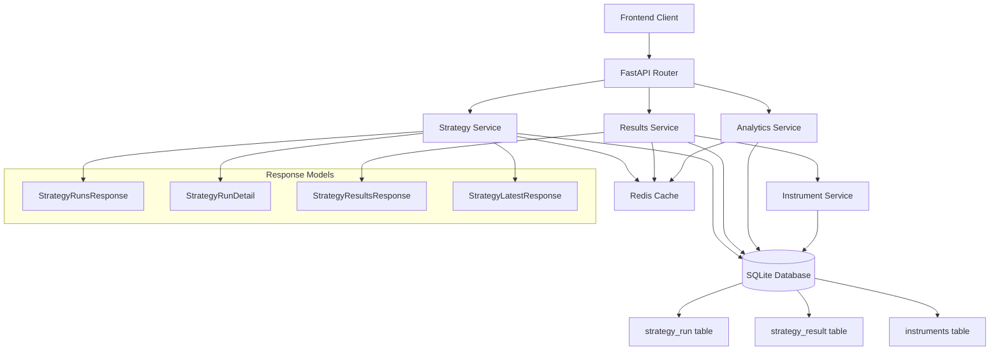

# Strategy Results API Design Specification

## Overview

This document provides a comprehensive design for strategy results data models and API endpoints that extend the existing automated-trader backend architecture. The design follows established patterns from the existing codebase and supports strategy run history, individual result details, performance summaries, and pagination for large result sets.

## Database Schema Analysis

### Existing Tables
Based on the current schema (v4), we have:

```sql
-- strategy_run table
CREATE TABLE strategy_run (
    run_id          TEXT PRIMARY KEY,
    strategy_code   TEXT NOT NULL,
    version         TEXT NOT NULL,
    params_hash     TEXT NOT NULL,
    params_json     TEXT NOT NULL,
    started_at      TEXT NOT NULL,
    completed_at    TEXT,
    universe_source TEXT,
    universe_size   INTEGER,
    min_score       INTEGER,
    exit_status     TEXT,
    duration_ms     INTEGER
);

-- strategy_result table  
CREATE TABLE strategy_result (
    run_id         TEXT NOT NULL REFERENCES strategy_run(run_id) ON DELETE CASCADE,
    strategy_code  TEXT NOT NULL,
    ticker         TEXT NOT NULL,
    passed         INTEGER NOT NULL,
    score          REAL,
    classification TEXT,
    reasons        TEXT,
    metrics_json   TEXT NOT NULL,
    created_at     TEXT NOT NULL,
    PRIMARY KEY (run_id, ticker)
);
```

### Key Indexes
- `ix_run_strategy_started` on `strategy_run(strategy_code, started_at)`
- `ix_result_strategy` on `strategy_result(strategy_code)`
- `ix_result_score` on `strategy_result(score)`
- `ix_result_ticker` on `strategy_result(ticker)`

## Pydantic Data Models

### Core Strategy Result Models

```python
from datetime import datetime
from typing import List, Optional, Dict, Any, Union
from pydantic import BaseModel, Field, ConfigDict

class StrategyMetrics(BaseModel):
    """Individual strategy metrics parsed from metrics_json."""
    # Core metrics (common across strategies)
    close: Optional[float] = None
    score: Optional[float] = None
    change_pct: Optional[float] = None
    
    # Technical indicators
    rsi14: Optional[float] = None
    macd: Optional[float] = None
    macd_signal: Optional[float] = None
    macd_hist: Optional[float] = None
    
    # Moving averages
    sma10: Optional[float] = None
    sma50: Optional[float] = None
    sma200: Optional[float] = None
    sma10_above: Optional[bool] = None
    sma50_above: Optional[bool] = None
    sma200_above: Optional[bool] = None
    
    # Volume metrics
    volume: Optional[int] = None
    vol_avg20: Optional[int] = None
    volume_multiple: Optional[float] = None
    vol_continuity_ratio: Optional[float] = None
    
    # Breakout metrics
    ref_high: Optional[float] = None
    breakout_pct: Optional[float] = None
    extension_pct: Optional[float] = None
    breakout_move_atr: Optional[float] = None
    
    # Risk and entry metrics
    risk: Optional[str] = None
    recommendation: Optional[str] = None
    entry_quality: Optional[str] = None
    suggested_stop: Optional[float] = None
    atr14: Optional[float] = None
    
    # Scoring breakdown
    points_sma: Optional[int] = None
    points_macd: Optional[int] = None
    points_rsi: Optional[int] = None
    points_volume: Optional[int] = None
    points_high: Optional[int] = None
    extra_score: Optional[int] = None
    
    # Additional strategy-specific metrics
    additional_metrics: Dict[str, Any] = Field(default_factory=dict)
    
    model_config = ConfigDict(extra='allow')

class StrategyResultDetail(BaseModel):
    """Individual ticker result with full metrics."""
    run_id: str
    strategy_code: str
    ticker: str
    passed: bool
    score: Optional[float] = None
    classification: Optional[str] = None
    reasons: List[str] = Field(default_factory=list)
    metrics: StrategyMetrics
    created_at: str
    
    # Enriched data (from instruments table)
    company_name: Optional[str] = None
    sector: Optional[str] = None
    industry: Optional[str] = None
    instrument_type: str = "stock"
    
    model_config = ConfigDict(from_attributes=True)

class StrategyRunDetail(BaseModel):
    """Extended strategy run information with performance stats."""
    run_id: str
    strategy_code: str
    version: str
    params_hash: str
    params_json: str
    started_at: str
    completed_at: Optional[str] = None
    universe_source: Optional[str] = None
    universe_size: Optional[int] = None
    min_score: Optional[int] = None
    exit_status: Optional[str] = None
    duration_ms: Optional[int] = None
    
    # Performance summary
    passed_count: Optional[int] = None
    total_results: Optional[int] = None
    pass_rate: Optional[float] = None
    avg_score: Optional[float] = None
    max_score: Optional[float] = None
    min_score_actual: Optional[float] = None
    
    # Score distribution
    score_ranges: Optional[Dict[str, int]] = None  # e.g., {"0-20": 5, "21-40": 10, ...}
    
    # Top performers preview
    top_results: List[StrategyResultDetail] = Field(default_factory=list)
    
    model_config = ConfigDict(from_attributes=True)

class StrategyRunSummary(BaseModel):
    """Lightweight run summary for list views."""
    run_id: str
    strategy_code: str
    started_at: str
    completed_at: Optional[str] = None
    universe_size: Optional[int] = None
    passed_count: Optional[int] = None
    pass_rate: Optional[float] = None
    avg_score: Optional[float] = None
    duration_ms: Optional[int] = None
    exit_status: Optional[str] = None
    
    model_config = ConfigDict(from_attributes=True)

class StrategyResultsResponse(BaseModel):
    """Paginated results for a specific run."""
    run_id: str
    strategy_code: str
    results: List[StrategyResultDetail]
    total_count: int
    passed_count: int
    failed_count: int
    page: int = 1
    page_size: int = 50
    
    # Summary statistics
    summary: Dict[str, Any] = Field(default_factory=dict)

class StrategyRunsResponse(BaseModel):
    """Paginated list of strategy runs."""
    runs: List[StrategyRunSummary]
    total_count: int
    page: int = 1
    page_size: int = 20
    
    # Aggregated stats across runs
    strategy_stats: Optional[Dict[str, Any]] = None

class StrategyLatestResponse(BaseModel):
    """Latest runs by strategy type."""
    latest_runs: List[StrategyRunDetail]
    strategies: List[str]  # Available strategy codes
    total_strategies: int
```

### Query Parameter Models

```python
class StrategyRunsQueryParams(BaseModel):
    """Query parameters for strategy runs endpoints."""
    strategy_code: Optional[str] = Field(None, description="Filter by strategy code")
    status: Optional[str] = Field(None, description="Filter by exit status (ok, error, timeout)")
    date_from: Optional[str] = Field(None, description="Filter runs from date (ISO format)")
    date_to: Optional[str] = Field(None, description="Filter runs to date (ISO format)")
    limit: int = Field(20, ge=1, le=100, description="Maximum number of results")
    offset: int = Field(0, ge=0, description="Number of results to skip for pagination")
    order_by: str = Field("started_at", description="Sort field (started_at, completed_at, passed_count)")
    order_desc: bool = Field(True, description="Sort in descending order")

class StrategyResultsQueryParams(BaseModel):
    """Query parameters for strategy results endpoints."""
    passed: Optional[bool] = Field(None, description="Filter by pass/fail status")
    min_score: Optional[float] = Field(None, description="Minimum score threshold")
    max_score: Optional[float] = Field(None, description="Maximum score threshold")
    classification: Optional[str] = Field(None, description="Filter by classification (Buy, Watch, Wait)")
    ticker: Optional[str] = Field(None, description="Filter by ticker symbol")
    sector: Optional[str] = Field(None, description="Filter by sector")
    limit: int = Field(50, ge=1, le=500, description="Maximum number of results")
    offset: int = Field(0, ge=0, description="Number of results to skip for pagination")
    order_by: str = Field("score", description="Sort field (score, ticker, created_at)")
    order_desc: bool = Field(True, description="Sort in descending order")
```

## API Endpoint Specifications

### 1. GET /api/strategies/runs

**Description:** List all strategy runs with pagination and filtering

**Query Parameters:**
- `strategy_code` (optional): Filter by strategy code
- `status` (optional): Filter by exit status (ok, error, timeout)
- `date_from` (optional): Filter runs from date (ISO format)
- `date_to` (optional): Filter runs to date (ISO format)
- `limit` (optional, default: 20, max: 100): Number of results per page
- `offset` (optional, default: 0): Number of results to skip
- `order_by` (optional, default: "started_at"): Sort field
- `order_desc` (optional, default: true): Sort in descending order

**Response:** `StrategyRunsResponse`

**Status Codes:**
- `200 OK`: Success
- `400 Bad Request`: Invalid query parameters
- `500 Internal Server Error`: Database or processing error

**Example Request:**
```
GET /api/strategies/runs?strategy_code=bullish_breakout&limit=10&order_by=started_at&order_desc=true
```

**Example Response:**
```json
{
  "runs": [
    {
      "run_id": "12345678-1234-1234-1234-123456789abc",
      "strategy_code": "bullish_breakout",
      "started_at": "2024-01-15T10:30:00Z",
      "completed_at": "2024-01-15T10:45:00Z",
      "universe_size": 500,
      "passed_count": 23,
      "pass_rate": 4.6,
      "avg_score": 72.5,
      "duration_ms": 900000,
      "exit_status": "ok"
    }
  ],
  "total_count": 45,
  "page": 1,
  "page_size": 20,
  "strategy_stats": {
    "unique_strategies": 3,
    "total_runs": 45,
    "avg_pass_rate": 5.2,
    "last_run": "2024-01-15T10:30:00Z"
  }
}
```

### 2. GET /api/strategies/runs/{run_id}

**Description:** Get specific run details with results summary

**Path Parameters:**
- `run_id`: Unique run identifier

**Response:** `StrategyRunDetail`

**Status Codes:**
- `200 OK`: Success
- `404 Not Found`: Run not found
- `500 Internal Server Error`: Database or processing error

**Example Response:**
```json
{
  "run_id": "12345678-1234-1234-1234-123456789abc",
  "strategy_code": "bullish_breakout",
  "version": "1.0",
  "params_hash": "abc123def4",
  "params_json": "{\"min_score\": 70, \"strict_macd\": false}",
  "started_at": "2024-01-15T10:30:00Z",
  "completed_at": "2024-01-15T10:45:00Z",
  "universe_source": "db_instruments",
  "universe_size": 500,
  "min_score": 70,
  "exit_status": "ok",
  "duration_ms": 900000,
  "passed_count": 23,
  "total_results": 500,
  "pass_rate": 4.6,
  "avg_score": 72.5,
  "max_score": 95.0,
  "min_score_actual": 45.2,
  "score_ranges": {
    "0-20": 45,
    "21-40": 123,
    "41-60": 189,
    "61-80": 98,
    "81-100": 45
  },
  "top_results": [
    {
      "ticker": "AAPL",
      "passed": true,
      "score": 95.0,
      "classification": "Buy",
      "metrics": {
        "close": 150.25,
        "rsi14": 72.5,
        "score": 95.0
      }
    }
  ]
}
```

### 3. GET /api/strategies/runs/{run_id}/results

**Description:** Get paginated results for a specific run

**Path Parameters:**
- `run_id`: Unique run identifier

**Query Parameters:**
- `passed` (optional): Filter by pass/fail status
- `min_score` (optional): Minimum score threshold
- `max_score` (optional): Maximum score threshold
- `classification` (optional): Filter by classification
- `ticker` (optional): Filter by ticker symbol
- `sector` (optional): Filter by sector
- `limit` (optional, default: 50, max: 500): Number of results per page
- `offset` (optional, default: 0): Number of results to skip
- `order_by` (optional, default: "score"): Sort field
- `order_desc` (optional, default: true): Sort in descending order

**Response:** `StrategyResultsResponse`

**Status Codes:**
- `200 OK`: Success
- `404 Not Found`: Run not found
- `400 Bad Request`: Invalid query parameters
- `500 Internal Server Error`: Database or processing error

**Example Request:**
```
GET /api/strategies/runs/12345678-1234-1234-1234-123456789abc/results?passed=true&min_score=80&limit=25
```

### 4. GET /api/strategies/latest

**Description:** Get latest runs by strategy type

**Query Parameters:**
- `strategy_codes` (optional): Comma-separated list of strategy codes to include
- `limit` (optional, default: 10, max: 50): Number of latest runs per strategy

**Response:** `StrategyLatestResponse`

**Status Codes:**
- `200 OK`: Success
- `500 Internal Server Error`: Database or processing error

## Error Handling Patterns

Following the existing API conventions:

```python
class StrategyErrorResponse(BaseModel):
    """Strategy-specific error response."""
    error: str
    message: str
    detail: Optional[str] = None
    status_code: Optional[int] = None
    run_id: Optional[str] = None  # Include run_id if error is run-specific

# Common error scenarios:
HTTP_400_BAD_REQUEST = {
    "error": "invalid_parameters",
    "message": "Invalid query parameters provided",
    "detail": "min_score must be between 0 and 100"
}

HTTP_404_NOT_FOUND = {
    "error": "run_not_found", 
    "message": "Strategy run not found",
    "detail": "No run found with id: 12345678-1234-1234-1234-123456789abc"
}

HTTP_500_INTERNAL_ERROR = {
    "error": "database_error",
    "message": "Failed to retrieve strategy results",
    "detail": "Database connection timeout"
}
```

## Implementation Architecture

### Service Layer Structure

```
backend/services/
├── strategy_service.py       # Core strategy operations
├── strategy_results_service.py  # Results-specific operations  
└── strategy_analytics_service.py  # Performance analytics
```

### Key Service Methods

```python
class StrategyService:
    def get_runs(self, filters: StrategyRunsQueryParams) -> StrategyRunsResponse
    def get_run_detail(self, run_id: str) -> StrategyRunDetail
    def get_latest_runs(self, strategy_codes: List[str], limit: int) -> StrategyLatestResponse

class StrategyResultsService:
    def get_run_results(self, run_id: str, filters: StrategyResultsQueryParams) -> StrategyResultsResponse
    def get_result_detail(self, run_id: str, ticker: str) -> StrategyResultDetail
    def enrich_results_with_instrument_data(self, results: List[StrategyResultDetail]) -> List[StrategyResultDetail]

class StrategyAnalyticsService:
    def calculate_run_performance(self, run_id: str) -> Dict[str, Any]
    def get_score_distribution(self, run_id: str) -> Dict[str, int]
    def calculate_strategy_trends(self, strategy_code: str, days: int) -> Dict[str, Any]
```

### Database Query Patterns

**Efficient run listing with performance stats:**
```sql
SELECT 
    sr.*,
    COUNT(res.ticker) as total_results,
    SUM(CASE WHEN res.passed = 1 THEN 1 ELSE 0 END) as passed_count,
    AVG(res.score) as avg_score,
    MAX(res.score) as max_score,
    MIN(res.score) as min_score_actual
FROM strategy_run sr
LEFT JOIN strategy_result res ON sr.run_id = res.run_id
WHERE sr.strategy_code = ? AND sr.started_at >= ?
GROUP BY sr.run_id
ORDER BY sr.started_at DESC
LIMIT ? OFFSET ?
```

**Results with instrument enrichment:**
```sql
SELECT 
    res.*,
    inst.sector,
    inst.industry,
    inst.instrument_type
FROM strategy_result res
LEFT JOIN instruments inst ON res.ticker = inst.ticker
WHERE res.run_id = ? AND res.passed = ?
ORDER BY res.score DESC
LIMIT ? OFFSET ?
```

### Caching Strategy

- Cache strategy run summaries for 5 minutes
- Cache latest runs by strategy for 2 minutes  
- No caching for individual result details (real-time requirement)
- Cache score distributions and analytics for 10 minutes

### Performance Considerations

1. **Pagination:** Enforce reasonable limits (max 500 results per page)
2. **Indexing:** Leverage existing indexes for optimal query performance
3. **Lazy Loading:** Load metrics_json only when detailed metrics requested
4. **Connection Pooling:** Use existing database connection patterns
5. **Async Operations:** Follow FastAPI async patterns for I/O operations

## Mermaid Architecture Diagram



## Migration and Compatibility

### Database Schema Changes
No database schema changes required - design fully utilizes existing v4 schema.

### API Versioning
Follow existing patterns:
- Version in URL: `/api/v1/strategies/runs`
- Header-based versioning as fallback
- Maintain backward compatibility for existing endpoints

### Feature Flags
- Enable new endpoints via feature flags
- Gradual rollout of enhanced analytics
- A/B testing for different response formats

## Security Considerations

1. **Input Validation:** Strict validation of all query parameters
2. **SQL Injection:** Use parameterized queries exclusively  
3. **Rate Limiting:** Apply rate limits to prevent abuse
4. **Authentication:** Follow existing auth patterns
5. **Data Filtering:** Ensure users only access authorized data

## Testing Strategy

### Unit Tests
- Test all Pydantic models with valid/invalid data
- Test service methods with mocked database responses
- Test query parameter validation

### Integration Tests  
- Test complete API endpoints with real database
- Test pagination edge cases
- Test error handling scenarios

### Performance Tests
- Load testing with large result sets
- Database query performance verification
- Memory usage with complex metrics parsing

## Deployment Considerations

1. **Monitoring:** Add metrics for API performance and usage
2. **Logging:** Structured logging for debugging and audit
3. **Documentation:** Auto-generated OpenAPI documentation
4. **Health Checks:** Extend existing health checks for new endpoints

This design provides a comprehensive, scalable foundation for strategy results APIs that follows established patterns while enabling rich analytics and efficient data access.